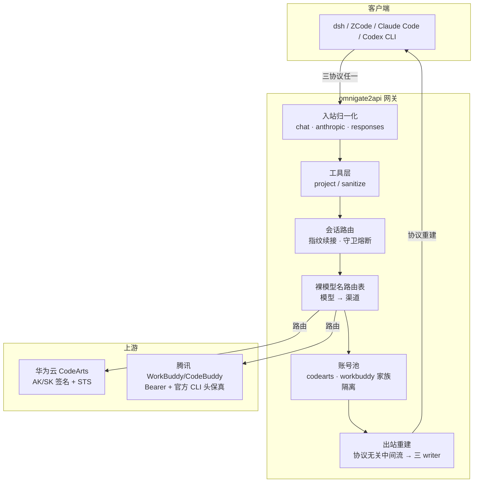

# OmniGate2API

**v1.3.0** · MIT · [release notes](#特性总览) · 华为云 CodeArts Agent 的 OpenAI 兼容代理**增强版**


> 无需运行 CodeArts Agent 客户端，纯 Go 直连华为云 API。在开源基线之上新增了对**活动（福利）模型**、**每日自动领取**、**真流式工具调用**、**长会话指纹续接**、**三协议入站（Anthropic / Responses）**、**工具层（投影/反监控）**与**限流治理**的完整支持，并附有离线集成测试与契约测试。核心卖点：**结构化的通用协议适配层**——上游差异全部声明化，内核与协议无关。

## 特性总览

### 通用协议适配层




同类反代通常把上游适配逻辑散写在代码里；本项目把「非标准上游 → OpenAI 语义」做成**规范化、声明式、可复用**的三层管线（规范见 `docs/SPEC-adaptation-layer.md`）：

- **Profile 声明一切**：向上游能力用一份 YAML 描述——消息形态（text-only 折叠/结构化角色）、流式帧语义（增量/快照/终结）、会话模型与信任度、鉴权与续期、限流分类、工具模拟参数、工具层开关。**接入新上游 = 写一份 Profile，不改内核**（`OMNIGATE_PROFILES_DIR` 外部加载，多上游按 `X-Provider` 路由）。
- **协议无关中间流**：入站三协议先归一化为统一消息模型，经指纹路由/折叠后由同一管线执行上游调用，响应再标准化为 `content/reasoning/tool_calls/finish` 中间流、由各协议 writer 重建线格式——**三协议共享一个内核，而非三套平行实现**。
- **原生等价默认**：默认全量折叠、信息可验证、零上游记忆依赖；增量（指纹续接）是显式 opt-in；工具层默认全关。任何语义偏差可观测、可熔断、可回退。
- **多上游并存隔离**：会话指纹表、守卫熔断器按 Profile 隔离——不同上游互不串号，一个上游抖动不波及其它。

### 登录与鉴权
- **门户二段握手修复**：华为云线上门户登录后回调携带 `secret+redirect`（无 code），
  原协议实现会卡死在"缺少 code"。本实现自动把浏览器带回门户页完成授权确认，
  code 正常下发后换取 STS 临时凭证（PKCE 全链路）。
- 标配：多账号轮转、token 到期自动 refresh 续期、保活心跳、凭证目录 `auths/`。

### 华为云活动（福利）模型
- 支持华为云官方活动（福利）模型 `glm-5.3-flash` / `deepseek-v4-flash-0731` / `deepseek-v4-pro-0813`：
  与普通模型共用 `POST /v1/chat/completions`，自动追加 `maas_type: benefit` 请求头，
  由后端路由到 MaaS 福利网关（缺失该头会得到 `InferHub.002002009.404 model not registered`）。
- **每日自动领取**：复刻官方客户端登录时的领取调用
  （`POST opengw.developer.huaweicloud.com/api/v1/benefit/claim`，AK/SK 签名、幂等），
  调度器按北京时间自然日为每个账号自动领取，并记录当日余额；
  完全脱离官方客户端。额度每日 1000 万 tokens、24 点重置。
- 网关配置/余额接口封装：`benefit/claim`、`gateway/config`、`user/tokens/balance`。

### 真流式工具调用（OpenAI 工具线格式）
- 文本/思考实时逐增量透传（不再整段聚合后回放）。
- **围栏容错**：容忍 ```` ```tool_call ```` 标记间的零宽字符/空格；
  区分闭合围栏与"下一个调用的起始围栏"（模型漏写闭合时当作分隔符）；
  围栏体 JSON 自动修复漏转义的 Windows 路径反斜杠；UTF-8 切割永远落在
  多字节字符边界（CJK 无乱码）。
- **叙述即意图**：模型在长会话中改用折叠历史的私标记「叙述」（
  `[助手调用工具 Name 参数 {json}]`）而非围栏时，按行解析成真实 `tool_calls`；
  `[工具 … 返回结果]` 这类自证假结果整行抑制。
- **回合语义收束**：发出首个调用后正文进入抑制态——模型"自导自演"的工具结果
  结构上到不了客户端；非流式响应同样在首个调用处截断。
- 提示词护栏：禁止模仿转录格式、编造工具结果/执行现场（含 `[TOOL_RESULT]`、📝 装饰等），
  要求参数完整转义。

### 长会话性能（指纹续接，路线 D）
- OpenAI 协议无会话 ID，但同一客户端会话的每轮消息数组是上一轮的前缀+增量。
  本实现用滚动哈希链（`H_i = sha256(H_{i-1}‖role‖content‖toolcalls)`）识别前缀，
  命中即**只折叠增量**并复用上游 `chat_id` 会话记忆：
  - 实测多轮下提示词从 6.1k → 恒定 ~3.6k（旧路径 20 轮内线性涨至 9.7k+）；
  - 边界：重试不续接、账号不健康回退全量、按 Profile trust 重锚定（默认 low=5 轮）、
    失败回合清除指纹、指纹表 LRU 128。

### 三协议入站（v1.1）
- 同一折叠/指纹/工具模拟管线同时服务三种客户端协议：
  - `POST /v1/chat/completions`（OpenAI，原有）
  - `POST /v1/messages`（Anthropic，Claude Code / CC Switch）
  - `POST /v1/responses`（OpenAI Responses，Codex CLI）
- 协议无关流式管线：上游增量 → `content/reasoning/tool_calls/finish` 中间流 →
  按协议重建事件序列（`message_start/input_json_delta/message_stop`、
  `response.created/output_text.delta/response.completed`），全程真流式不缓冲重放。
- `/v1/messages/count_tokens` 返回真估算（非恒 0 stub）。
- **跨协议续接**：三协议共用同一指纹索引；chat 与 Responses/Anthropic 交替使用
  同一会话时，前缀一致即可续接（增量折叠），不一致安全回退全量。
- 入站协议可用 `inbound.protocols` 按 Profile 收窄（缺省全开）。

### 多渠道上游（v1.1+）
- 同一内核并存第二条上游：**腾讯 WorkBuddy/CodeBuddy**（copilot.tencent.com，
  `X-Provider: workbuddy` 路由）与华为 CodeArts。账号池按**客户端家族**隔离
  （华为 AK/SK 签名 / 腾讯 Bearer），互不混用也互不波及。
- 腾讯 Profile 为 **roles 原生透传**（不经折叠）：OpenAI messages 语义保真
  （system/tool_calls/tool_call_id），模型名与 tools 原样上送；工具模拟层
  对其关闭（上游原生 function calling）。
- 登录：`login-tencent url` → 浏览器授权 → `login-tencent poll`，凭证落盘
  `auths/workbuddy-{uid}.json`（独立命名空间，与华为并存）。
- 腾讯侧 sanitize 默认开启（上游内容审核对 client 合规模板误伤是实证刚需）；
  会话默认全量（指纹增量待真链路实测后评估）。
- **腾讯积分全自动（v1.4，SPEC §32；CN + 全球版双域支持 §32.6）**：调度器全链路自动化——每日签到
  （`daily-checkin`，即「Buddy 加油站」积分，实测 +100/天，解析 credit/streak/
  活动状态）、成长中心任务接单与领奖（`tasks/accept` + `tasks/{code}/claim`，
  积分+能量主来源）、宠物探险状态机（status/config/depart/claim，归来自动领分）
  与宠物激活（**免费领养优先**：活跃上报→协议→`buddy/first`（实证 +300 积分 +8 能量）；
  能量开盲盒兜底）；宠物探险循环实跑（派出→归来领分→再派）。活动面故障只记日志、
  不影响聊天账号健康。**全球版（www.workbuddy.ai）实证无签到/任务中心**（社区+我方双实证），
  其积分面仅一次性 trial 加油包（已领）；领养前置需客户端级事件链，暂未解锁。
- **裸模型名路由（v1.3）**：客户端只发模型名，渠道完全由网关侧路由表决定
  （默认表 = 两渠道清单合并，撞名组裁决给 codearts，撞名 fail-fast 拒绝重复注册）；
  `X-Provider` 保留为显式覆盖。`/v1/models` 无渠道时返回唯一视图（每模型名一条，
  附 `family` 字段）。
- **删除 = 禁用（v1.3）**：路由表条目可禁用——禁用模型的请求返回 `404
  model_not_found`（不回落缺省渠道，显式渠道亦不可绕过）；禁用集随保存全量
  落盘，面板可逐个恢复。
- **快捷追加（v1.3）**：渠道模型全貌表每行带「＋」按钮，一键加入路由表
  （已存在则提示），保存后生效。
- **WebUI 管理入口（v1.3）**：控制台新增「模型与路由」——查看各渠道模型全貌、
  路由表增删改（保存即热生效并落盘 `data/routes.json`）；账户管理（启用/禁用/
  清冷却/保活/授权登录）沿用。

### 工具层（v1.1，默认全关，显式 opt-in）
- `OMNIGATE_TOOLCHAIN=none|project|sanitize|project,sanitize` 或 Profile `toolchain.*` 开启：
  - **项目投影（project）**：为长上下文 agent 客户端压缩历史（agentic 检测 →
    规则摘要 + 尾保留 + anchor user + 工具 schema 白名单）；有损 ⇒ 自动强制
    native（与增量互斥）。
  - **反监控（sanitize）**：缓解上游关键词审核对客户端合规模板（拒绝作恶声明/
    harness 运行时上下文）的误伤——零宽插词/指纹剥离/harness 摘要；只动
    system/developer 与命中 harness 标记的 user，真实用户输入不可达；
    内置词表刻意排除真实有害类别词（仅解决模板误伤，不提供绕过手段）。

### 稳定性与治理
- **客户端取消豁免**：`context.Canceled/DeadlineExceeded` 不计账号错误、不触发冷却。
- **MaaS 限流软冷却**：429/MaaS 错误 → 45 秒软冷却退避，SSE 错误负载携带
  `rate_limit_error`/`retryable` 提示。
- 首字节超时 300s（冷启动/大会话不误杀）；上游不发显式终止帧直接 EOF 时
  合成 `finish_reason`。

### 可观测性
- 每轮折叠尺寸日志（`chat fold ... continue=true/false`）；
- `TRANSCRIPT_ECHO` 漂移检测：模型输出中出现转录标记复述/编造时记录并落盘样本；
- `OMNIGATE_DEBUG_PROMPTS` 开启折叠提示词全文落盘（`data/prompts/`）。

## 快速开始

### 登录（华为云账号）

```bash
# 本机有浏览器（Windows 需先构建二进制，见下）
./login.sh

# 服务器（无浏览器）：打印链接，任意机器浏览器打开，ticket 轮询下发
./login.sh -print-only

# 凭证落盘 auths/codearts-{user_id}.json
```

> **Windows 注意**：`-print-only` 模式生成的授权链接 `port=0`，浏览器回流必然断链；
> 本机有浏览器时务必用**回调模式**（不带 `-print-only`，工具会在 `127.0.0.1:随机端口`
> 监听并自动打开浏览器）。Windows 二进制可在含 Go 的容器中交叉编译，
> 例如：`GOOS=windows GOARCH=amd64 CGO_ENABLED=0 go build -o bin/omnigate2api-login.exe ./cmd/login`。

### 启动

```bash
cp config.example.json config.json
export OMNIGATE_API_KEY=你的随机密钥
./bin/omnigate2api -config config.json        # Linux
# Windows: .\bin\omnigate2api.exe -config config.json
```

### 验证 + WebUI

```bash
curl http://127.0.0.1:7866/healthz
curl http://127.0.0.1:7866/v1/models -H "Authorization: Bearer $OMNIGATE_API_KEY"
curl -X POST http://127.0.0.1:7866/v1/chat/completions \
  -H "Authorization: Bearer $OMNIGATE_API_KEY" -H "Content-Type: application/json" \
  -d '{"model":"glm-5.2","messages":[{"role":"user","content":"你好"}]}'
```

浏览器打开 **http://127.0.0.1:7866/** 即 WebUI：账号/token 状态、额度余额、模型与路由管理、调度状态。

### Docker

```bash
export OMNIGATE_API_KEY=你的随机密钥
mkdir -p auths data
cp config.example.json config.json   # 注意：示例须为严格 JSON
docker compose up -d --build
```

### 腾讯渠道（workbuddy）登录与使用

```bash
# 登录（设备流）：打印授权链接 → 浏览器完成授权 → poll 取凭证落盘
docker compose exec omnigate2api omnigate2api-login-tencent url
docker compose exec omnigate2api omnigate2api-login-tencent poll
docker compose restart omnigate2api          # 新账号加载进池
```

- 凭证落盘 `auths/workbuddy-{uid}.json`（与华为 `codearts-*` 命名空间并存，家族隔离）；
- 使用：显式渠道用请求头 `X-Provider: workbuddy`；v1.3 起无需渠道头——直接发裸模型名，
  网关按路由表自动分流（`kimi-k2.7` / `hy3` 等 → 腾讯，`glm-5.2` 等 → 华为），
  路由表可在 WebUI「模型与路由」里增删改；
- 腾讯侧功能：每日自动签到（幂等）+ 积分余额查询（`daily-checkin` /
  `get-user-resource`），随调度器（北京时间）运行。

## 环境变量

| 变量名 | 说明 | 默认值 |
|--------|------|--------|
| `OMNIGATE_API_KEY` | API 访问密钥 | - |
| `OMNIGATE_LISTEN` | 监听地址 | `:7866` |
| `OMNIGATE_AUTH_DIR` | 凭证目录 | `./auths` |
| `OMNIGATE_STATE_FILE` | 状态文件 | `./data/state.json` |
| `OMNIGATE_DEFAULT_MODEL` | 默认模型 | `glm-5.2` |
| `OMNIGATE_WATCH_ENABLED` | 调度器开关（续期/保活/福利领取） | `true` |
| `OMNIGATE_MAX_CONCURRENT` | 单账号最大并发 | `5` |
| `OMNIGATE_DEBUG_PROMPTS` | 折叠提示词落盘目录（可观测） | 关闭 |
| `OMNIGATE_SESSION_MODE` | 会话模式：`native`（默认，全量折叠）/ `incremental`（指纹增量 opt-in） | 空 → Profile 声明 |
| `OMNIGATE_TOOLCHAIN` | 工具层覆盖：`none` / `project` / `sanitize` / `project,sanitize` | 空 → Profile 声明 |
| `OMNIGATE_PROFILES_DIR` | 外部 Profile YAML 目录（多上游声明化接入） | 空 |
| `OMNIGATE_UPSTREAM_BASE` | 覆盖华为引擎地址（测试/实验，一般不设） | 内置 |
| `OMNIGATE_TENCENT_BASE` | 覆盖腾讯 copilot 地址（测试/实验） | copilot.tencent.com |
| `OMNIGATE_ROUTES_FILE` | 裸模型名路由表（WebUI 保存；缺省 `data/routes.json`） | 自动 |
| `OMNIGATE_MEDIA` | 非文本块语义全局覆盖（SPEC §30）：`placeholder`（默认，占位折叠）/ `passthrough`（图片分片透传，仅 roles 渠道生效） | 空 → Profile 声明 |

## 目录结构（增补要点）

- `internal/adapt/` — **通用协议适配层**：Profile（八组能力声明）、注册表（YAML 外部化/多上游）、
  守卫熔断器；内核与上游无关，接入新上游只写 Profile
- `internal/upstream/` — 引擎/福利网关客户端、SSE 解析（增量流式化）
- `internal/server/` — 三协议路由（chat/anthropic/responses）、工具调用模拟层（围栏解析/转录识别/流式过滤器）、
  协议无关流式管线与出站重建器、会话指纹索引、工具层（sanitize/project）、观测与集成测试
- `internal/scheduler/` — 看门狗：token 续期、保活、**每日福利领取**
- `internal/pool/` — 账号池：轮转、并发、冷却、持久化状态

## 测试

```bash
go test ./...        # 单元 + 集成（假上游驱动的离线集成测试，无需真实账号）
go test -race ./...  # 竞争检测（需 CGO）
```

## 已知边界

- 活动模型走 MaaS 网关，存在按分钟的 token 限流（429），已配 45s 软冷却；
  日常长会话建议主力模型用 `glm-5.2`（常规引擎，无 MaaS 限额）。
- "叙述/编造"类输出是模型遵循度问题：代理侧做了结构抑制与检测，不保证 100% 根除；
  长会话下 flash 系模型漂移概率更高。
- **多模态图片（v1.4）**：三协议入站图片统一归一化；**双上游图片透传已实证落地**
  （SPEC §30.9/§31.1）：OpenAI 标准 `image_url` 分片 + data URI 内联直送上游，
  URL 图片由网关转 base64（SSRF 防护）；单图 ≤10MB、每消息 ≤8 张（华为模型侧
  另有 ~1MB 裁断）。腾讯（kimi/hy4 等）与华为视觉模型（qwen3-vl-235b 等）均可看图；
  无视觉能力的模型收到图片会按上游报错暴露（换视觉模型即可）。
- **华为通道 roles 化（v1.4，SPEC §31）**：华为上游实证为标准 OpenAI 兼容多模态
  端点，消息改为真实多轮数组直传（转录折叠/标记渲染退役，"叙述/编造"模仿面随之
  消失）；原生 tools 上游不支持（实证），工具调用继续走围栏模拟（注入末条 user）；
  指纹续接（增量折叠）对华为退役，每轮全量数组。
- 以上均为本地增强实现，回馈上游不在本仓库范围内。

## 安全

- **密钥纪律**：`auths/`（凭证）、`data/`、`config.json`、`.env` 一律 git 忽略且不入库；凭证文件写盘权限 0600、目录 0700；日志与标准输出不含任何凭证值（oauth 回调仅记字节长度）。
- **暴露面**：compose 默认绑定 `127.0.0.1:7866` 且 **`OMNIGATE_API_KEY` 默认为空 = 免密**（本地单用户：API Key 与面板密钥均无需填写，`change-me` 同样视为未配置）；局域网/远程共享请改回 `7866:7866` 并**必须**设置真实 `OMNIGATE_API_KEY`（此时 Bearer 与面板 localStorage 密码即防线）；公网部署请置于受控网络或前置反代鉴权。
- **面板密钥**：浏览器输入的 API key 仅存于本机 localStorage（panel.html 内有明示），共享机器慎用。

## 参考项目

本项目的协议逆向与实现参照以下开源项目（MIT，版权归原作者所有）：

- **HITZY2002/codearts2api** — 华为云 CodeArts 反向适配的上游项目（本仓库 fork 祖先）
- **Sliverkiss/workbuddy2api** — 腾讯 WorkBuddy/CodeBuddy 上游协议实证（Go，端点/头/计费形态的直接参照）
- **ShouZhuo0413/codebuddy2api** — 腾讯 CodeBuddy 协议适配（Python，参照其事件流与刷新形态）

## 免责声明

仅供学习和研究使用。使用者需遵守华为云服务条款，自行承担使用风险。

## 仓库与出处

- **公开仓库**：[github.com/orangeofcarl0-sys/omnigate2api](https://github.com/orangeofcarl0-sys/omnigate2api)

## License

MIT（基于上游 MIT 实现的增强分支；版权与许可声明遵循原项目）。
