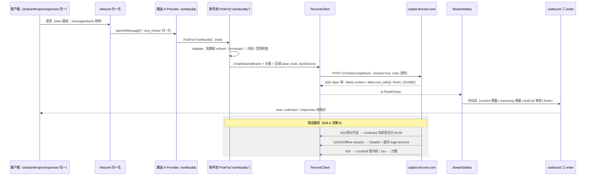

# SPEC — 反代协议适配层（Adaptation Layer）

> 状态：Draft v0.5 · 日期：2026-09-05 · 范围：omnigate2api 全部适配逻辑
> 目标：把"非标准上游 → OpenAI 原生语义"的转换做成**规范化、声明式、可复用**的
> 三层管线；默认面承诺原生语义等价（模型所见 = 客户端所发），增量仅作为显式
> opt-in 的性能插件，且任何语义偏差可观测、可熔断、可回退。
> v0.2 变更：入站扩展为三协议（chat / anthropic / responses），新增工具层
> （toolchain：有损投影 + 反监控，均默认关闭），会话指纹统一到归一化消息模型
> 并支持跨协议续接，出站新增两套协议重建器。
> v0.3 变更：多渠道上游（workbuddy/codebuddy 腾讯 copilot 接入）——消息结构
> 泛化为完整 OpenAI 消息（roles 透传路径兑现）、上游客户端接口化（ChatAPI
> 双实现）、账号池引入 Profile 维度（凭证双命名空间），全部决策见 §21。
> v0.3.1 变更：以两个已上生产的同网关参考实现（codebuddy2api Python /
> workbuddy2api Go）对账本实现，收敛 §27 待实测项（会话无状态、refresh
> envelope、tool_choice string、模型清单端点均实证定稿），拍板四项决策
> （官方 CLI 头全量对齐 / 完整错误语义迁移 / family 动态模型拉取 / 工具
> 单帧完整参数），六缺口修复方案见 §28。
> v0.4 变更：裸模型名路由与 WebUI 管理入口（§29）——渠道与模型名彻底解耦，
> 删除 = 禁用语义，路由表落盘 data/routes.json。
> v0.5 变更：多模态图片透传立项（§30）——三协议图片归一化与占位对齐、
> URL→base64 转换层（SSRF 防护）、Profile `message.media` 兑现 §13.3 预留
> 接口位、真链路 probe 条件拍板树；§20.2「不实现多模态像素透传」随之撤销。

---

## 1. 目标与非目标

### 目标
1. 对任何"像 OpenAI 但又不完全 OpenAI"的上游，接入成本 = 写一份 Profile，而非改内核。
2. 默认行为满足原生等价：输入信息可验证（全量折叠）、输出线格式合规、会话无状态。
3. 增量优化（依赖上游隐式会话记忆）显式 opt-in，带守卫矩阵与自动熔断。
4. 全部语义决策可观测、可审计、可回退。

### 非目标
1. 不保证模型对折叠标记的"原理级透明"（那是模型行为工程；实践层达成：输出不含标记、客户端不可见）。
2. 不做自动探测上游能力（无元数据可查，能力由 Profile 声明）。
3. 不在协议层发明 OpenAI 之外的会话语义（显式会话 ID 仅作为客户端主动标识被尊重）。

---

## 2. 术语表

| 术语 | 定义 |
|---|---|
| 原生等价（native） | 模型本次输入信息 = 客户端本次请求消息的全部；不依赖任何上游记忆 |
| 增量（incremental） | 模型本次输入 = 本次增量 + 上游隐式会话记忆（不可验证部分） |
| Profile | 一份上游能力描述（消息/流/会话/鉴权/限额/工具/工具层七组字段） |
| trust | 会话记忆可信度：low/medium/high → 重锚定周期 5/10/20 轮 |
| 守卫（guard） | 增量模式下维持语义正确性的机械约束（锚点/串线锁/重锚定） |
| 熔断（circuit breaker） | 守卫事件连续触发时，自动降级 native 并告警 |
| 工具层（toolchain） | 出站前的可选变换 stage 链：有损投影（project）、反监控（sanitize）；均为显式 opt-in |
| 投影（projection） | 组件在折叠前压缩消息数组（历史摘要/裁尾/anchor），有损，默认关 |
| 反监控（sanitize） | 组件在上送前改写触发审核的合规模板文本（零宽插词/指纹剥离/harness 摘要），默认关 |
| 归一化（normalize） | 入站三协议 → 统一内部消息模型（openAIMessage[]）的纯函数映射 |
| 消息形态（roles） | Profile.message.model="roles"：上游原生接受 OpenAI messages 结构，不经折叠，归一化数组原样透传 |
| 客户端家族（ChatAPI） | 上游聊天的统一能力接口（ChatStream/RefreshToken），华为/腾讯各自实现，内核对接口编程 |
| 凭证命名空间 | auths/ 按 Profile 前缀分文件（codearts-*.json / workbuddy-*.json），单凭证结构多命名空间 |

---

## 3. 总体架构

```
┌────────────────────────────────────────────────────────────┐
│ 客户端（ZCode / Codex CLI / Claude Code / 任意 OpenAI 客户端）│
│   → /v1/chat/completions（OpenAI 原生语义）
│   → /v1/messages（Anthropic 语义）
│   → /v1/responses（OpenAI Responses 语义）
└───────────────┬────────────────────────────────────────────┘
                │
┌───────────────▼────────────────────────────────────────────┐
│ 入站规范层（inbound）                                         │
│   - 协议归一化：chat/anthropic/responses → 统一消息模型       │
│     （纯函数 adapter；非文本块按 §13.3 占位）                 │
│   - 解析、校验、鉴权；会话路由（显式 ID / 指纹 / 全量）        │
│   - 折叠渲染（Profile.folding 驱动，含护栏块）                 │
├────────────────────────────────────────────────────────────┤
│ 工具层（toolchain，可选 stage 链，默认全关）                   │
│   - [project?]  有损投影：agentic 检测 → 历史摘要/裁尾/anchor  │
│   - [sanitize?] 反监控：零宽插词 / 指纹剥离 / harness 摘要     │
│   - 指纹计算点：在 toolchain 全部变换之后（见 §15.1）          │
├────────────────────────────────────────────────────────────┤
│ 会话语义层（session）                                         │
│   - 策略：native | incremental(explicit) | incremental(fingerprint)│
│   - 守卫：指令锚点 / contended 串线锁 / 重锚定(trust)          │
│   - 熔断器：守卫事件计数 → 自动降级 native + 告警              │
│   - 会话指纹表（LRU，仅 incremental-指纹 模式启用）             │
├────────────────────────────────────────────────────────────┤
│ 上游适配层（upstream）                                        │
│   - 调用（签名、令牌、路由，AuthProfile 驱动）                │
│   - 流式读（StreamProfile 驱动：增量/快照/终结/合成）           │
│   - 错误分类（LimitsProfile 驱动：限流/冷却/重试标记）          │
├────────────────────────────────────────────────────────────┤
│ 输出规范层（outbound）                                        │
│   - 中间流（协议无关：content/reasoning/tool_calls/finish）   │
│   - chat：SSE 增量/终止/DONE 合规 · 快照替换 · 错误负载        │
│   - anthropic：content_block/input_json_delta/message_stop   │
│   - responses：output_text.delta/function_call_arguments     │
└────────────────────────────────────────────────────────────┘
```

**不变式**：
1. 入站层不得裁剪客户端上下文——除非 toolchain.project 显式启用（有损即声明），
   或 Profile.session.trust=implicit 且当前模式为 incremental（由会话语义层
   声明并守卫）；sanitize 只改写 system/developer 段与命中 harness 标记的
   user 段，真实用户文本不可达。
2. 指纹的计算输入 = **toolchain 全部变换之后的最终消息数组**（描述的是上游
   实际看到的会话，保证前缀可复算）。
3. 输出层永远符合各协议的线格式（OpenAI SSE / Anthropic 事件 / Responses 事件）。

---

## 4. 层 1：Profile 规范

### 4.1 Go 结构（实现基准）

```go
type UpstreamProfile struct {
    ID      string `yaml:"id"`
    Display string `yaml:"display"`

    Inbound InboundProfile  `yaml:"inbound"`
    Message MessageProfile  `yaml:"message"`
    Stream  StreamProfile   `yaml:"stream"`
    Session SessionProfile  `yaml:"session"`
    Auth    AuthProfile     `yaml:"auth"`
    Limits  LimitsProfile   `yaml:"limits"`
    Tool    ToolProfile     `yaml:"tool"`
    Toolchain ToolchainProfile `yaml:"toolchain"`
}

// InboundProfile 入站协议面（启用哪几个入站端点；归一化见 §13）。
type InboundProfile struct {
    Protocols []string `yaml:"protocols"` // "chat" | "anthropic" | "responses"；缺省三者全开
}

type MessageProfile struct {
    Model string `yaml:"model"` // "roles" | "text-only"
    // 非文本块语义（§30）：placeholder=占位折叠（缺省）/ passthrough=原生分片透传
    // （仅限 roles；枚举无 none——静默丢图被 §30.2 否决）；env 覆盖 OMNIGATE_MEDIA
    Media string `yaml:"media,omitempty"`
    // text-only 时必填：
    Folding *FoldingConfig `yaml:"folding,omitempty"`
}

type FoldingConfig struct {
    Markers    map[string]string `yaml:"markers"`     // 角色→标记（[助手]等）
    GuardBlock string            `yaml:"guard_block"` // 收尾护栏文本
    // 非文本块的占位文本模板（§13.3）：如 "[用户发送了一张图片]"
    MediaPlaceholder string `yaml:"media_placeholder,omitempty"`
}

type StreamProfile struct {
    DeltaEvents      []string `yaml:"delta_events"`       // 增量事件名（"" 表示无 event 前缀）
    SnapshotEvents   []string `yaml:"snapshot_events"`    // 全文快照事件（替换语义）
    Terminators      []string `yaml:"terminators"`        // 终止事件名
    EOFIsTerminal    bool     `yaml:"eof_is_terminal"`    // EOF 即结束 → 需合成 finish
    SynthesizeFinish bool     `yaml:"synthesize_finish"`  // 上游缺失终止帧时合成
}

type SessionProfile struct {
    Kind  string `yaml:"kind"`   // "none" | "explicit" | "implicit"
    Trust string `yaml:"trust"`  // 仅 implicit："low"|"medium"|"high"
    // 重锚定轮数：0 = 按 trust 默认（low=5 / medium=10 / high=20）
    ReanchorEvery int `yaml:"reanchor_every,omitempty"`
}

type AuthProfile struct {
    RefreshSupported bool   `yaml:"refresh_supported"`
    ReauthCommand    string `yaml:"reauth_command,omitempty"` // 如 relogin.bat 的提示
}

type LimitsProfile struct {
    RateLimitHints      []string `yaml:"rate_limit_hints"`      // 429/MaaS 判定文本
    SoftCooldownSeconds int      `yaml:"soft_cooldown_seconds"` // 默认 45
    ErrCooldownSeconds  int      `yaml:"err_cooldown_seconds"`  // 默认 600
    ErrThreshold        int      `yaml:"err_threshold"`         // 默认 3
}

type ToolProfile struct {
    FenceOpen          string `yaml:"fence_open"`            // "```tool_call"
    BracketCallPrefix  string `yaml:"bracket_call_prefix"`   // "[助手调用工具 "
    JSONRepair         bool   `yaml:"json_repair"`           // 裸反斜杠修复
    PostSuppress       bool   `yaml:"post_suppress"`         // 首调用后抑制
    FenceTolerantScan  bool   `yaml:"fence_tolerant_scan"`   // 零宽/空格容错
}

// ToolchainProfile 工具层（出站前可选 stage 链；指针存在即启用，缺省全关，见 §14）。
type ToolchainProfile struct {
    Project *ProjectConfig `yaml:"project,omitempty"` // 有损投影（默认关）
    Sanitize *SanitizeConfig `yaml:"sanitize,omitempty"` // 反监控（默认关）
}

type ProjectConfig struct {
    AgenticDetect bool `yaml:"agentic_detect"` // 命中 agentic 特征只记建议日志（缺省 true）
    HistoryItems  int  `yaml:"history_items"`  // 摘要保留条数（默认 10）
    HistoryChars  int  `yaml:"history_chars"`  // 摘要总字符上限（默认 2200）
    TailMessages  int  `yaml:"tail_messages"`  // 尾保留消息数（默认 8）
    TailChars     int  `yaml:"tail_chars"`     // 尾字符上限（默认 7000）
    AnchorUser    bool `yaml:"anchor_user"`    // 保留最早被投影的 user（默认 true）
    ToolMaxChars  int  `yaml:"tool_max_chars"` // 工具 arguments/output 上限（默认 1600）
}

type SanitizeConfig struct {
    Mode           []string `yaml:"mode"`             // "zwsp" | "strip" | "compact"
    Terms          []string `yaml:"terms,omitempty"`  // 覆盖内置触发词表（§14.3）
    StripMetadata  bool     `yaml:"strip_metadata"`   // 删 tool description
    HarnessUser    bool     `yaml:"harness_user"`     // 允许处理命中 harness 标记的 user
    HarnessBlocks  []struct {
        Start   string `yaml:"start"`
        End     string `yaml:"end"`
        Replace string `yaml:"replace"`
    } `yaml:"harness_blocks,omitempty"`
    Fingerprints []struct {
        Match  string `yaml:"match"`  // 命中即剥离
        Rewrite [2]string `yaml:"rewrite,omitempty"` // 逐字替换（改一词，语义不变）
    } `yaml:"fingerprints,omitempty"`
}
```

### 4.2 校验规则（Schema 级）

- `message.model` 为 `text-only` 时必须提供 `folding`；
- `session.kind == "implicit"` 时必须提供 `trust`；
- `stream.SynthesizeFinish` 为 true 时建议 `EOFIsTerminal=true`（否则合成无意义）；
- `limits.RateLimitHints` 至少一项；`tool` 各项均有缺省值（见 DEFAULT 表）；
- `toolchain.project` / `toolchain.sanitize` 配置存在即启用；`sanitize.mode` 至少一项；
- `inbound.protocols` 缺省补全为全量三协议。

### 4.3 内置 Profile：codearts（当前实现的一次性迁移）

```yaml
id: codearts
inbound:
  protocols: []                # 空 = 三协议全开（§13.4 缺省）；需收窄时显式列出
message:
  model: text-only
  folding:
    markers: { system: "[系统指令]", assistant: "[助手]", tool: "[工具 {n} 返回结果]", call: "[助手调用工具 {n} 参数 {json}]" }
    guard_block: "…现有 [回复要求] 护栏文本…"
stream:
  delta_events: ["", "message", "delta", "content", "onanswer", "answer"]
  snapshot_events: []            # message/text 帧为替换语义(见已知限制 §12)
  terminators: ["done", "end", "finish"]
  eof_is_terminal: true
  synthesize_finish: true
session:
  kind: implicit
  trust: low                      # 实测记忆不可靠（"失忆"事件）
auth:
  refresh_supported: false        # 华为 OAuth 不返回 refresh_token
  reauth_command: "relogin.bat"
limits:
  rate_limit_hints: ["429", "rate limit", "MaaS"]
  soft_cooldown_seconds: 45
  err_cooldown_seconds: 600
  err_threshold: 3
tool:
  fence_open: "```tool_call"
  bracket_call_prefix: "[助手调用工具 "
  json_repair: true
  post_suppress: true
  fence_tolerant_scan: true
```

### 4.4 外部化与注册

- 加载顺序：内置注册表 → `OMNIGATE_PROFILES_DIR/*.yaml`（覆盖同名/新增上游）；
- 校验失败：启动报错并拒绝加载（fail-fast）；
- 多上游路由：`/v1/chat/completions` 按 body 中 `provider` 字段或 API Key
  前缀映射 Profile；缺省 `codearts`。

---

## 5. 层 2：会话语义规范

### 5.1 模式与路由表

| 条件（Profile.session + 请求特征） | 模式 | 说明 |
|---|---|---|
| kind=none，或未开启 incremental | `native` | 全量折叠；信息可验证 |
| kind=explicit 且 conversation_id 有效 | `incremental(explicit)` | 显式会话 ID 粘性 + tail-only |
| kind=implicit 且指纹命中且账号健康 | `incremental(fingerprint)` | 增量 + 上游记忆（受守卫约束） |
| 其余（含歧义/contended/不健康/超重锚定轮数） | `native`（自动降级） | 单向安全回退 |

### 5.2 守卫矩阵（incremental 下全部生效）

| 守卫 | 强制不变式 | 违反后果 |
|---|---|---|
| 指令锚点（tailAnchorIndex） | tail 起点不再进入助手/工具段之前已折叠的 user | 无指令反问 |
| contended 串线锁 | 同一历史哈希被多会话占用即拒绝续接 | 上下文串线 |
| 重锚定（trust） | low=5 / medium=10 / high=20 轮全量重锚定 | 上游记忆退化失忆 |
| 记忆失效缓解 | 重锚定以客户端完整 messages 为准 | 同上 |

### 5.3 熔断器

- **事件定义**（可观测计数器单位）：
  - `guard_noinstruction`：守卫锚点事件之外，模型输出含"无指令/无上下文"表述（指纹采样）；
  - `guard_cross`：contended 拒绝次数；
  - `guard_miss`：回退 native 次数（含重锚定、不健康、歧义）。
- **触发条件**：任一事件在 **5 分钟窗口内 ≥ 3 次** → 熔断打开。
- **动作**：当前 Profile 强制 `native`；设置 `circuit=on`；告警日志
  `FUNDAMENTAL_GUARD_BREACH profile=<id> event=<type> count=<n>`。
- **恢复**：熔断 30 分钟后自动复位回 Profile 声明模式；人工可用
  `OMNIGATE_SESSION_MODE` 覆盖（`native` / `incremental`，空 = Profile 声明）。

### 5.4 指纹表

- LRU 上限 128；仅 incremental(fingerprint) 模式触达；
- 计算输入：**toolchain 全部变换之后的最终消息数组**（§15.1）——指纹描述上游
  实际看到的会话；表项与协议无关（chat / anthropic / responses 归一化后共用）；
- 注册时机：回合成功（全量或增量均注册最新全量哈希）；
- 清理：重锚定、contended 翻转、账号不健康、熔断开。

---

## 6. 层 3：输出规范行为契约

| 能力 | 行为契约 |
|---|---|
| 增量合规 | 文本/思考增量逐帧；UTF-8 rune 边界；无零宽注入 |
| 终止合规 | `finish_reason` 帧 + `[DONE]` 必有其一（EOF 时合成） |
| 快照替换 | 上游快照帧：新内容长→增量；短→整段替换（不越界、不 panic） |
| 错误负载 | SSE error 事件含 message/type/code；429 类 type=`rate_limit_error`+`retryable=true` |
| 工具线格式 | `tool_calls` delta（index/id/function 完整）与 `finish_reason=tool_calls` |
| 抑制 | 首调用后正文抑制（Profile.tool.post_suppress）与叙述行转换（bracket） |

---

## 7. 可观测性

- `chat fold` 日志追加 `mode=` 与 `profile=`；
- 计数指标（进程内，`/status` 暴露）：`folds{native,incremental}`、
  `guard_events{type}`、`circuit{state}`、`reanchors`；
- 事件样本：`TRANSCRIPT_ECHO`、`FUNDAMENTAL_GUARD_BREACH` 均落盘样本（抽样）。

---

## 8. 配置入口

| 环境变量 | 默认 | 说明 |
|---|---|---|
| `OMNIGATE_SESSION_MODE` | 空 → Profile 声明 | `native` / `incremental` 人工覆盖 |
| `OMNIGATE_TOOLCHAIN` | 空 → Profile 声明 | `none` / `project` / `sanitize` / `project,sanitize` 人工覆盖 |
| `OMNIGATE_PROFILES_DIR` | 空 | 外部 Profile YAML 目录 |
| `OMNIGATE_DEBUG_PROMPTS` | 空 | 折叠样本落盘 |

---

## 9. 测试策略

- 单元：Profile 校验、路由表、守卫矩阵、熔断计数；
- 集成（假上游驱动）：native/incremental 各模式的 429/轮换/指纹/串线/失忆场景；
- 契约测试：所有输出帧符合 §6 行为契约；
- 迁移要求：每一阶段全量测试绿 + 真链路 smoke（pi 两轮）。

---

## 10. 迁移路线

| 阶段 | 产出 | 验收 |
|---|---|---|
| 1 套壳 | `adapt/`（profile.go）、`inbound/`、`session/`、`outbound/` 目录成立，现有逻辑原样搬入 | 行为不变；测试全绿 |
| 2 声明化 | profile 驱动路由与参数；移除散落 env 开关 | 默认 native；incremental 显式开关等行为与现状一致 |
| 3 开放 | `OMNIGATE_PROFILES_DIR` 多上游注册 + YAML 校验 + 路由 | 第二份测试 Profile 接入并跑通集成测试 |

---

## 11. 开放边界与已知限制

1. 折叠标记的模型侧透明性：协议层无解；实践层（输出不含标记、客户端不可见）已达成，属护栏+检测的持续职责；
2. 上游记忆无元数据可查：trust 只能人工声明；熔断是防御不是检测；
3. 快照事件的"增量/替换"语义判定依赖文本长度差，极端情形（连续快照文本恰好长度相等）可能产生空增量——行为保守（无输出），不崩溃；
4. `incremental` 是**性能插件**：任何语义偏差都按 §5.3 计为守卫事件，可熔断回 native。

---

## 12. 与现有实现的映射（迁移时一一对应）

| 层 | 现有代码 | 迁移去向 |
|---|---|---|
| 入站折叠 | `internal/server/prompt.go` | inbound/folding |
| 入站路由 | `internal/server/handler.go: routeSession` | inbound/routing |
| 会话语义 | `internal/server/session.go` | session/ |
| 守卫（anchor/contended/重锚定） | session.go / handler.go | session/guards |
| 上游调用/签名 | `internal/upstream/client.go` | upstream/(按 Profile 参数化) |
| 流式读 | `internal/upstream/sse.go` | upstream/stream |
| 错误分类 | `internal/upstream/sse.go IsRateLimitMessage` | upstream/limits |
| 输出规范 | sse.go `StreamDeltas/SSEChunkWriter` | outbound/ |
| 工具层 | fence.go / streamfilter.go | inbound/tools（按 ToolProfile 参数化） |
| 观测 | observe.go | outbound/observability |

---

## 13. 入站多协议归一化（v0.2 新增）

### 13.1 统一内部消息模型

三协议全部解析为统一内部模型 `openAIMessage` 数组（internal/server/request.go，
含 system 语义；system/developer 内容在折叠时提前），指纹与会话系统（§5）共用
此模型，协议无关。

```
chat       → parseChatRequest（现有，不变）
anthropic  → /v1/messages 端点：anthropicAdapter.Message 纯函数
responses  → /v1/responses 端点：responsesAdapter.Response 纯函数
```

### 13.2 归一化矩阵

| 入站元素 | chat（现有） | anthropic | responses |
|---|---|---|---|
| system / instructions | system 消息 | system（字符串或 text 块数组）→ 前导 system 消息 | `instructions` → 前导 system 消息 |
| developer | 并入 system | 同左 | `role=developer` item → system 消息 |
| 用户文本 | user 消息 | content text 块 → user 消息 | input 字符串 → user 消息；`output_text` item → assistant 文本 |
| 工具调用 | assistant.tool_calls | assistant `tool_use` 块 → ToolCalls（input dict → arguments JSON 字符串） | 相邻 assistant + `function_call` item 合并为一条带 ToolCalls 的 assistant |
| 工具结果 | role=tool + tool_call_id | user 内容里的 `tool_result` 块 → 独立 role=tool 消息（与相邻 text 合并为前置 user） | `function_call_output` item → role=tool 消息 |
| 思考链 | reasoning_content 字段 | assistant `thinking` 块 → 丢弃（客户端不回发，参与指纹会破坏前缀可复算性） | reasoning item summary → 丢弃（同左） |
| tools | tools 数组 | `input_schema` → parameters | 扁平 `{name,parameters,strict}` → 嵌套 function 格式 |
| tool_choice | 现有对象/字符串解析 | auto/any/none 适配 | 同 anthropic；strict 保留透传 |
| stream | 透传 | 透传 | 透传（真流式，见 §16） |
| max_tokens | max_completion_tokens 兜底 | max_tokens | max_output_tokens / max_tokens → max_tokens |
| provider 路由 | `X-Provider` / body.provider | 同左 | 同左 |

### 13.3 非文本块的折叠（多模态占位）

- text-only 上游无像素通道：非文本块（image / file 等）统一折叠为占位文本，
  默认 `[用户发送了一个附件：{type}]`，可用 `folding.media_placeholder` 模板覆盖；
  占位保留位置与提示语义（模型知道有附件并继续追问），不传像素。
- **多模态通道（v0.5 落地，§30）**：Profile 增加 `message.media: "placeholder"|"passthrough"`
  能力字段（v0.5 修正：枚举删除 `none`——静默丢图违反「信息可验证」原则）；
  `passthrough` 仅限 roles profile（text-only 无像素通道，registry 校验 fail-fast）。
  占位文本纳入指纹计算（与正文同权）。图片透传完整设计、转换层与条件拍板树见 §30。

### 13.4 端点半开

- `inbound.protocols` 声明启用的入站端点，缺省三者全开；
- 每个端点独立鉴权（同一 `api_key`）、独立限流计数（池共用）。

---

## 14. 工具层（toolchain）

### 14.1 定位与原则

- 工具层 = 出站前（折叠渲染前）的可选变换 stage 链，**全部默认关闭**；
- 每个 stage 是**纯函数**（消息数组 → 消息数组 / 文本 → 文本），可独立单测；
- 语义偏差可观测原则：stage 命中即记录统计日志（`toolchain stage=… hits=… chars=…`）；
  命中前后 sha256 摘要落 `chat fold` 日志，供审计与回退对比；
- 作用域纪律：sanitize 默认只动 system/developer 段；`harness_user` 未显式开启时
  真实 user 文本**不可达**（仅命中 harness 标记的 user 段可被处理，判定函数如 §14.4）；
- **互斥规则**：`project` 启用 ⇒ 本回合强制 native（有损后前缀不可复算，禁止与
  incremental 组合）；`sanitize` 与 incremental 可共存（指纹在变换后计算，§15.1）。

### 14.2 project：有损投影

目标：为长上下文 agent 客户端（Codex CLI / Claude Code）在显式启用时压缩消息数组，
降低上游提示体积。参考实现：[Python 版 responses_projection](参考来源注 1)。

| 项 | 契约 |
|---|---|
| 启用 | `toolchain.project` 配置存在即启用（或 `OMNIGATE_TOOLCHAIN=project`） |
| agentic 检测 | 工具名命中 agentic 集合（exec_command/write_stdin/update_plan/apply_patch 等）或消息含 harness 标记（`# AGENTS.md instructions`/`<environment_context>`/`<system-reminder>` 等）；**命中仅记「建议开启投影」日志，不自动启用** |
| 模式 | 未检测到 agentic：conservative（单条消息截断：system 1200 / user 3200 / assistant 1800 字符，截头尾保留）；检测到：aggressive（摘要 + 裁尾 + anchor） |
| aggressive 规则 | ①丢弃 harness system/user 消息（计数上报）②保留 system 合并（最多 2 条，各 ≤1200 字符）③历史 → 规则摘要（`Earlier conversation summary (condensed):` + 逐条 `User asked:/Assistant replied:/Tool X returned:`，上限 `history_items` 条 / `history_chars` 字符）④tail 保留（`tail_messages` 条 / `tail_chars` 字符，且向 tool 依赖的前置 assistant tool_calls 方向扩展）⑤`anchor_user`：最早被投影掉的 user 原样保留 ⑥工具维度：schema 白名单（type/properties/required/items/enum/oneOf/anyOf/allOf/additionalProperties/format/min/max 等 16 键，深度 >6 退化为 `{"type":"object"}`）、description 可删（`strip_metadata`）、arguments/output 超 `tool_max_chars` 头尾裁剪 |
| 回退 | 投影后消息为空 → 回退 conservative；变换前后字符数/丢弃数记日志 |
| 影响 | 启用时指纹链**不适用**（强制 native 全量折叠，投影结果全量上送） |

### 14.3 sanitize：反监控

目标：消除上游关键词/逐字匹配审核对**客户端合规模板**的误伤（如「Refuse requests
for DoS attacks, exploit development...」拒绝作恶声明、Claude Code/Codex 的 harness
运行时上下文）；**不做、也不声明可绕过对真实有害输入的审核**（参考来源注 2、3）。

| 项 | 契约 |
|---|---|
| 启用 | `toolchain.sanitize` 配置存在即启用（或 `OMNIGATE_TOOLCHAIN=sanitize`）；默认关 |
| mode=zwsp | 触发词内向第 1 个字符后插入 U+200B（`DoS → Do\u200bS`）；大小写不敏感、长词优先匹配；人/模型读取无感，关键词/子串匹配被断 |
| mode=strip | runtime 块替换：`<environment_context>`、`<permissions instructions>`、`<skills_instructions>`、`<system-reminder>` 等开闭标记块 → 中性短句；ToolSearch 等 tail 段 → 一句摘要 |
| mode=compact | harness system 全文（`You are Claude Code` / Codex system 标记）→ 固定两句标准助手摘要；permissions/skills 子块各自浓缩句 |
| 触发词表 | 内置基线收敛两家的公开词表（SENSITIVE_TERMS 约 90 词：安全声明高频词 + 品牌词）；`terms` 可整体覆盖 |
| 指纹剥离 | `fingerprints`：键值/header 型指纹整段剥离（如 `x-anthropic-billing-header:...`）；尾随裸键值 `cc_xxx=...;` 循环清理；语义模板句逐字替换（改一词，语义不变，如 `Main branch (→Default branch (`） |
| 作用域 | 默认 `roles=system,developer`；`harness_user: true` 且消息命中 harness 标记才允许动 user 段；真实用户输入不可达 |
| 预检快路径 | 未命中任何指纹/触发词 → 原样返回（零分配，`hasFingerprint` 式快速路径） |
| 与指纹的关系 | sanitize 在指纹计算前执行（§15.1），命中时指纹基于消毒后文本，前缀一致性保持，增量续接不受影响 |

### 14.4 harness 判定（两 stage 共用）

内置标记基线：`# AGENTS.md instructions`、`<environment_context>`、`<permissions
instructions>`、`<collaboration_mode>`、`<skills_instructions>`、`<system-reminder>`、
`# claudeMd`；system 侧另含 `You are a coding agent running in the Codex CLI`、
`You are Claude Code`。判定为纯函数（字符串/内容块检测），命中集可被 Profile
`harness_blocks` / `fingerprints` 扩展。

---

## 15. 会话语义扩展（v0.2 新增）

### 15.1 指纹计算点

- 原实现：`routeSession` 在折叠前按原始请求消息计算指纹；
- v0.2 规则：**指纹输入 = 归一化 → toolchain 全部变换之后的最终消息数组**；
  管线顺序固定为 `归一化 → sanitize → (project 命中则登记 native 并跳指纹) → 指纹/路由 → 折叠 → 上送`；
- 动机：指纹描述的是"上游实际看到的会话"，任何改写（sanitize 零宽/剥离）都不破坏
  前缀可复算性；投影为例外的显式有损路径，直接跳指纹。

### 15.2 跨协议续接

- 三协议共用同一 `sessionIndex`（按 Profile 隔离不变）与 chat_id 粘性；
- 同一会话在协议间切换（chat ↔ responses）时，若归一化消息数组前缀一致 → 可续接
  （增量/锚点/contended 锁全复用）；不一致 → 安全回退全量；
- 客户端回发的工具调用 id 必须为本地下发的 id（现有 `assignCallIDs` 保证），
  三种协议的回发归一化后与指纹输入一致（§13.2 矩阵保证同构）。

---

## 16. 出站多协议重建（v0.2 新增）

### 16.1 协议无关中间流

现有流式管线已将上游归一化为 `(content增量, reasoning增量, tool_calls事件, finish)`
——即协议无关中间流。chat 用现有 SSEChunkWriter；anthropic / responses 各一个
writer 从同一数据源重建事件序列。守卫检测（transcriptEcho / noContextEcho）作用于
中间流文本，与协议无关。

### 16.2 Anthropic 事件序列（/v1/messages 流式）

| 事件 | 触发 | 载荷要点 |
|---|---|---|
| `message_start` | 首个增量前 | message{id,model,role=assistant,type=message} |
| `content_block_start` | 首个文本增量 | index（按块序分配 0..n）、type=text / type=tool_use{id,name} |
| `content_block_delta` | 文本增量 | text_delta |
| `input_json_delta` | 工具调用发出 | partial_json（本地模拟层一次性得到完整 arguments，单帧发完；不强制分片） |
| `content_block_stop` | finish 到来（或流结束） | 关闭所有已开块，逐块 stop |
| `message_delta` | finish | stop_reason: stop→`end_turn` / tool_calls→`tool_use` / length→`max_tokens`；usage 估算 |
| `message_stop` | 全部收尾 | — |

- 块序规则：文本块（若有）先于工具块（post 抑制保证无"工具后正文"）。
- 非流式：`Message` 对象（content: [{type:text,...},{type:tool_use,id,name,input:dict}]，
  arguments JSON 字符串反序列化为 input 对象；stop_reason 同映射；usage 估算）。
- `POST /v1/messages/count_tokens`：返回基于折叠文本的**真估算**（复用 §6 的
  usageEstimate 规则，按 input_tokens 折算），不做恒 0 stub。

### 16.3 Responses 事件序列（/v1/responses 流式）

| 事件 | 触发 | 载荷要点 |
|---|---|---|
| `response.created` | 首个增量前 | response{id,object=response,status=in_progress} |
| `response.in_progress` | 同帧或次帧 | — |
| `output_item.added` | 文本：message item；工具：function_call item（arguments=""） | output_index 递增；message.content 空 |
| `content_part.added` | 文本 item 后 | part{type=output_text} |
| `output_text.delta` | 文本增量 | delta 串 |
| `function_call_arguments.delta` | 工具调用 | 单帧完整 arguments（同上，不强制分片） |
| `*.done` | 各级收尾 | output_text.done / content_part.done / output_item.done / function_call_arguments.done |
| `response.completed` | finish | 全部收尾后 |

- 非流式：`Response` 对象（output: [{type:message,role:assistant,content:[{type:output_text,text}]},
  {type:function_call,id,call_id,name,arguments}]；status=completed；usage 估算
  input_tokens/output_tokens 拆分近似）。

### 16.4 出站 usage 规范（对齐 Go 参考实现）

- 流式 chunk：usage 字段显式省略（客户端按协议容忍缺失；不做补 0 假数据）；
- 非流式/聚合响应：usage 为估算值（现有 usageEstimate）；
- anthropic/responses 对象：按各自 schema 给出拆分的 input/output 估算近似，
  总量与 chat 路径一致。

---

## 17. Profile schema 更新汇总（v0.2）

- 新增 `inbound.protocols`（§4.1）、`message.folding.media_placeholder`（§13.3）；
- 新增 `toolchain.project` / `toolchain.sanitize`（§14），全部字段有缺省值；
  校验规则见 §4.2 增补条目；
- 内置 codearts Profile：`inbound.protocols` 为空（三协议全开，§4.3）；`toolchain` 缺省为全关。

---

## 18. 采纳清单（参考实现迁移点）

| 来源 | 采纳项 | 落点 |
|---|---|---|
| Go 参考实现（workbuddy2api）`payload.go` | tool_choice 归一化表：`none`（含对象形）→ 删 tool_choice 且删 tools/functions；`auto/required` → 字符串；`function:{name}` → 字符串名；非标量 → 删 | 工具模拟层语义边界规范（本地 toolsActive 已达等效，本表作为 wire 层边界基准文档化） |
| Go 参考实现（workbuddy2api）`sse.go` | 出站 usage 显式 null / 省略规范；空流错误帧；`[DONE]` 兜底 | §6、§16.4 已并入 |
| Python 参考实现（codebuddy2api）`converter.py` | 三协议收敛骨架、tool_calls 按 index 聚合、finish 兜底 tool_calls | §13、§16 已并入 |
| Python 参考实现 `desensitize.py` | 零宽插词、harness 块替换、compact 摘要、作用域纪律（system 优先、真实 user 不可达） | §14.3 已并入（默认关） |
| Python 参考实现 `responses_projection.py` | agentic 检测、历史摘要、tail+anchor、工具 schema 白名单 | §14.2 已并入（默认关） |

参考来源注：
1. `F:\Codex_Work_Space\Public\_research\workbuddy2api`（Sliverkiss/workbuddy2api, Go）
2. `F:\Codex_Work_Space\Public\_research\codebuddy2api`（ShouZhuo0413/codebuddy2api, Python）
3. 两家源码模块注释均明确：反监控只缓解「客户端合规模板被上游关键词误伤」，
   不试图绕过对真实有害输入的审核；本规范保持同一边界（§14.3）。

---

## 19. 分期实现计划（v0.2）

| 阶段 | 产出 | 验收 |
|---|---|---|
| 4 归一化 | `internal/adapt/` 或 `internal/server/` 新增 adapter 纯函数（anthropic/responses → openAIMessage[]）、`/v1/messages`、`/v1/responses` 端点接线、`inbound.protocols` | 单测矩阵（§13.2 每行至少一例）+ 集成（假上游三协议各跑通）；chat 行为零回归 |
| 5 出站重建 | anthropic writer + responses writer（流式事件序列 + 非流式对象 + count_tokens 真估算） | 契约测试：事件序列顺序与载荷逐帧断言（对齐 §16.2/16.3 表格）；集成 |
| 6 工具层 | project/sanitize 纯函数 + Profile schema + 互斥规则 + `OMNIGATE_TOOLCHAIN` | 单测（表驱动：不改 user、不命中不变、长词优先、开关关闭逐字节一致）+ 集成（假上游断言变换后请求体）；指纹计算点迁移验证 |
| 7 终审计 | 全量测试（含 race）+ 文档一致性 + 真链路 smoke | 三协议 × native/incremental × toolchain 组合矩阵绿；工作区干净 |

---

## 20. 明确不做（v0.2）

1. **账号层面不新增**：不引入 Go 参考实现的 credits 加权轮换、定时签到/积分、
   次日恢复等（无对应上游积分体系；本地福利领取调度维持现状）；
2. （v0.5 撤销）多模态像素透传原列于此——v0.2 拍板「仅留 `media: passthrough`
   接口位」已被 v0.5 推翻，图片透传正式立项，设计与条件拍板见 §30；
3. 不做自动能力探测（保持 §1 非目标：能力由 Profile 声明）；
4. 投影/sanitize 不做全局默认开启（§14.1：显式 opt-in，不回退为两家参考实现
   的默认开/半默认开形态）。

---

## 21. 多渠道上游：workbuddy/codebuddy（腾讯 copilot）接入（v0.3）

### 21.1 定位与复用面

目标：在现有内核上并存第二个上游家族——腾讯 `copilot.tencent.com`
（WorkBuddy CN / CodeBuddy 同一网关，`codebuddy` 与 `workbuddy` 是同一
上游的客户端名差异，**共用一个 Profile**）。接入不改动现有内核路径：

| 现有能力 | 对腾讯上游 |
|---|---|
| X-Provider → Registry 路由 | 多上游并存骨架已存在，workbuddy 即注册表新成员，无第二套服务 |
| 三协议入站归一化 + 协议无关中间流 + 出站三 writer | 上游语义差异不影响出站：腾讯 delta 流经 StreamDeltas 进同一中间流 |
| 会话指纹/守卫熔断（按 Profile 隔离） | 复用（腾讯侧按 §21.2 决策默认全量） |
| 工具层 project/sanitize | sanitize 对腾讯是刚需（上游关键词审核误伤合规模板，参考实现实证），Profile 开启即用 |
| LimitsProfile 限流分类/冷却 | 腾讯 429 分类直接声明 |

### 21.2 已拍板决策（分歧点结论）

| 决策点 | 结论 | 理由 |
|---|---|---|
| 腾讯会话模型 | **默认全量**（Session.Kind=none，不依赖上游记忆）；指纹增量等真链路实测确认腾讯有会话记忆后再开 | 无证据前不打折信息可验证；参考实现（Sliverkiss）为无会话管理 |
| 消息结构 | **单一类型泛化**：ChatMessage 扩为完整 OpenAI 消息（Role/Content/ToolCalls/ToolCallID），text-only 折叠也用它（Role=user+折叠文本），全库一种类型 | 杜绝双线格式并存（§1 严禁额外兼容层） |
| 凭证模型 | **单结构双命名空间**：auth.Auth 增 EnterpriseID/Domain；腾讯 token 复用 CloudDragonTok/RefreshToken/Expiration 位；auths 按前缀分文件 | 字段重叠度高（令牌/refresh/过期/uid），独立类型需池泛化重构，不成比例 |
| 客户端组织 | **接口 + 双实现**：ChatAPI 接口（方法签名与现有一致）+ 华为 client.go / 腾讯 tencent_client.go，Account.Client 类型改接口 | 与"Profile 声明化、内核协议无关"同构；每上游一文件不纠缠 |

### 21.3 三个真实缺口与验收（每缺口独立提交）

**缺口 1：roles 透传路径兑现**（§22）
`MessageProfile.Model="roles"` 从声明到实现：归一化数组 → 原生 OpenAI messages
JSON 透传（system/assistant.tool_calls/tool 消息原样还原，content 为字符串）；
`toolsActive` 在 roles 下透传 tools 数组（不经围栏模拟）；ToolProfile 整组不适用。

**缺口 2：腾讯客户端**（§23）
ChatAPI 接口 + TencentClient：Bearer 鉴权、`/v2/chat/completions`、refresh 走
`/v2/plugin/auth/token/refresh`（X-Refresh-Token 头）、自定义头
（X-User-Id/X-Enterprise-Id/X-Domain/X-Product）、无 AK/SK 签名。

**缺口 3：账号池多上游**（§24）
Account.ProfileID、PickFor(profile, tried)、auths 命名空间前缀解析、刷新按
Profile 分发、scheduler 按 Profile 跳过华为专属福利领取。

---

## 22. 消息结构泛化与 roles 渲染（v0.3）

### 22.1 ChatMessage 泛化（实现基准）

```go
// upstream：统一线格式消息（text-only 折叠与 roles 透传共用）。
type ChatMessage struct {
    Role       string         // "system"|"user"|"assistant"|"tool"
    Content    string         // 字符串内容（归一化后内容已拍平）
    ToolCalls  []ChatToolCall // assistant 的工具调用（roles 时）
    ToolCallID string         // role=tool 时对应 call id
}
```

- text-only 折叠：单条 `{Role:"user", Content: 折叠文本}`（与现行为一致）；
- roles 透传：逐条 openAIMessage 映射；
- 序列化：`{"role","content","tool_calls"(可选),"tool_call_id"(可选)}`，
  `chatMessagesToOpenAI` 淘汰，统一序列化函数。

### 22.2 渲染两分支（buildUpstreamMessages 契约）

| Profile.message.model | 契约 |
|---|---|
| text-only | 现有折叠（renderFullPrompt/renderTailPrompt + 护栏），单条 user 消息 |
| roles | 归一化数组逐条映射原生 messages；system 并入首条 role=system；assistant.tool_calls 结构保留（arguments JSON 字符串）；tool 消息带 tool_call_id；**不经折叠、不加护栏** |
| 未知取值 | Validate 拒绝（保持现有 fail-fast） |

### 22.3 与其它机制的关系

- 工具层（project/sanitize）作用在 openAIMessage[]，先于渲染，两种形态共用；
- 指纹续接的 tail 切片在 roles 下同样成立（切片 → 原生透传），但腾讯侧
  按 §21.2 默认全量，增量机制仅在有实测证据后启用；
- ToolProfile（围栏/转录标记/post 抑制）仅 text-only 模拟层使用；roles 上游
  在其 Profile 中声明 tool 组缺省/关闭。

---

## 23. 上游客户端家族（v0.3）

### 23.1 ChatAPI 接口（实现基准，约 10 行）

```go
// upstream：上游聊天能力的统一约定（签名与现有一致，调用方写法不变）。
type ChatAPI interface {
    ChatStream(ctx context.Context, chatID string, messages []ChatMessage,
        traceID string, cred SignCredential, userName, model string,
        tools []map[string]any, toolChoice string) (io.ReadCloser, error)
    RefreshToken(ctx context.Context, cfg LoginConfig, refreshToken, codeVerifier, domain string) (*TokenResponse, error)
}
```

- `Account.Client` 类型：`*upstream.Client` → `upstream.ChatAPI`；
- handler/pool 调用点零改动（现有调用写法不变）；
- `Client`（华为）与 `TencentClient` 各自实现接口，互不纠缠；
- `tools`：roles 上游原样透传进 body（华为忽略该参的仅有实现差异除外）；
- `toolChoice`：腾讯上游为 string 语义（对象形态 → 400 code=11101），
  handler 按 §28.4 决策 D 归一化后传入；空串 = 不传（上游默认 auto）；
- `domain`：refresh 端点区域解析用（腾讯按后缀切 CN/global），华为忽略。

### 23.2 TencentClient 契约

| 项 | 值 |
|---|---|
| 聊天端点 | `{base}/v2/chat/completions`；base 区域感知（§28.4 决策 C）：凭证 domain 后缀 `.workbuddy.ai` → `www.workbuddy.ai`（global），否则 CN `copilot.tencent.com`；`OMNIGATE_TENCENT_BASE` 优先覆盖 |
| 鉴权 | `Authorization: Bearer <accessToken>` + `X-User-Id`/`X-Enterprise-Id`/`X-Domain`/`X-Product: SaaS`；无签名 |
| 头保真 | 官方 CLI 全量对齐（§28.4 决策 C）：UA `CLI/2.63.2 CodeBuddy/2.63.2`、Accept `application/json, text/plain, */*`、Origin/Referer 按区域（CN `www.codebuddy.cn`）；空字段发 `X-No-*: 1` 占位（X-No-Authorization / X-No-User-Id / X-No-Enterprise-Id / X-No-Department-Info，官方 CLI 约定） |
| refresh | `POST /v2/plugin/auth/token/refresh`，携带 `X-Refresh-Token` + `X-Auth-Refresh-Source: workbuddy`，无 body；响应 envelope `{code,msg,data:{accessToken,refreshToken,expiresIn,domain}}`（code==0 成功；data 缺省回退扁平结构以兼容测试上游）；expiresIn<=0 保留旧过期时间防刷新风暴 |
| 会话 | 无 chat_id 语义（两参考实现均无会话管理，§28.1 实证）；按 §21.2 全量发送 |
| 工具 | tools 数组原样透传；tool_choice 按上游 string 语义归一化（§28.4 决策 D），"none" 时连 tools 一并删除 |
| 错误分类 | 腾讯形态分类器（§28.4 决策 B）：402/积分不足 → CoolHard（冷却至次日 04:00）；`12153`/"Offline user session not found" → 永久禁用并提示 login-tencent；429 → CoolSoft；5xx → CoolErr 计数 |
| pool 构造 | `pool.New` 与 `AddAccount` 按 Profile 构造对应实现（工厂分发） |

### 23.3 变化面汇总

新增：`upstream/api.go`（ChatAPI）、`upstream/tencent_client.go`、
`AuthProfile.ClientFamily`（客户端家族声明，缺省 codearts，§24.1）；
修改：`pool.Account.Client` 类型、`pool.New/AddAccount` 工厂分发；
不改：handler、scheduler、指纹/熔断、出站三 writer。

---

## 24. 账号池多上游（v0.3）

### 24.1 Profile 维度

| 增补 | 契约 |
|---|---|
| `Account.ProfileID` | 账号所属**客户端家族**（codearts / workbuddy）；`PickExcluding` 增补 `PickFor(family, tried)`（空 = 全池，兼容既有调用）。同家族多 Profile 共享账号（如 codearts 与 echo 同用华为客户端） |
| auths 命名空间 | `codearts-*.json`（华为 STS）与 `workbuddy-*.json`（腾讯 token）按前缀解析；`auth.Auth` 增 `EnterpriseID`/`Domain` 字段（华为留空） |
| 凭证字段位 | 腾讯 accessToken→CloudDragonTok、refreshToken→RefreshToken、expiresAt→Expiration、uid→UserID、nickname→UserName |
| 刷新分发 | Validate 刷新按 `Account.ProfileID` 走对应客户端 RefreshToken（华为 STS refresh / 腾讯 /v2/plugin/auth/token/refresh） |
| state.json | 按 name(uid) 隔离（现结构不变，账号天然不跨 Profile 混用） |

### 24.2 scheduler 分支

- benefit 福利领取：仅华为（`ProfileID=="codearts"`）执行；
- 腾讯签到/积分：**已实现**（每日北京时间一次，DailyCheckin 幂等 + UserResource
  余额日志，BillingAPI 断言分发；`claimTencentCheckin` 与华为 benefit 并行）；
- keepalive/保活：共用。

### 24.3 登录 CLI

华为 PKCE 二段握手保持；腾讯 OAuth 设备流新增 `cmd/login-tencent`（或
`cmd/login -provider tencent`）。登录产出即落盘对应命名空间前缀。

---

## 25. workbuddy Profile 内置声明草案（v0.3）

```yaml
id: workbuddy
display: "Tencent WorkBuddy/CodeBuddy (copilot.tencent.com)"
inbound:
  protocols: []            # 缺省 = 三协议全开
message:
  model: roles             # 原生 OpenAI messages 透传（§22）
stream:
  delta_events: ["", "message", "delta", "content"]
  terminators: ["done", "end", "finish"]
  eof_is_terminal: true
  synthesize_finish: true
session:
  kind: none               # §21.2：默认全量；实测有记忆后再评估 implicit
auth:
  refresh_supported: true  # 腾讯 refresh_token 通道存在
  client_family: workbuddy # 池按家族隔离（§24.1）
  reauth_command: "login-tencent"
limits:
  rate_limit_hints: ["429", "rate limit"]
  soft_cooldown_seconds: 45
  err_cooldown_seconds: 600
  err_threshold: 3
tool:
  fence_open: ""           # 原生 function calling，模拟层关闭
  bracket_call_prefix: ""
  json_repair: false
  post_suppress: false
  fence_tolerant_scan: false
toolchain:
  sanitize:
    mode: [zwsp, strip, compact]   # 腾讯内容审核是刚需（参考实现实证）
```

> 注册方式：内置表（`adapt.NewRegistry(&Codearts, &Workbuddy)`）或外部
> `OMNIGATE_PROFILES_DIR/workbuddy.yaml`。字段待真链路实测校准（模型列表、
> 会话记忆、429 形态）。

---

## 26. 分期实现计划（v0.3）

| 阶段 | 产出 | 验收 |
|---|---|---|
| 8a | ChatMessage 泛化 + roles 渲染分支（§22） | 单测矩阵（text-only 零回归字节级 + roles 映射逐条）；集成（roles 假上游断言原生 messages） |
| 8b | ChatAPI 接口 + TencentClient（§23） | 假上游集成：鉴权头/tool 透传/refresh/429 分类；华为路径零回归 |
| 8c | 账号多上游（§24）：PickFor/auths 命名空间/刷新分发 + login-tencent CLI | 双上游共存集成（同池 codearts+workbuddy 各自健康/冷却/轮换）；腾讯凭证往返落盘 |
| 8d | workbuddy Profile 内置 + scheduler 分支 + SPEC/README 同步 | 组合矩阵（三协议 × 双上游 × toolchain）绿；race 全量；真链路 smoke（需腾讯账号） |
| 8e | 腾讯链路修复（§28.4）：原生 tool_calls 拼装、refresh envelope、官方 CLI 头保真、错误语义迁移、family 动态模型、tool_choice 归一化 —— **已实施**（假上游矩阵全绿） | 假上游矩阵：原生 tool_calls 增量帧 → 单帧 sink 断言（三协议）；refresh 双形态（envelope/flat）；头保真（UA/Accept/X-No-*/区域）断言；402→次日 04:00、12153→禁用策略集成；fake 模型端点（agent "cli" 过滤、缓存、回落静态）；tool_choice 归一化表 |
| 8f | 腾讯真链路 smoke（需腾讯账号）：三协议 + /v1/models + 到期自动刷新 | 三协议终态字节级一致；工具调用真实联通；429/风控形态与关键词表校准（§28.6） |

---

## 27. 明确不做 / 已实证定稿 / 待实测（v0.3.1）

1. **不做**：workbuddy 指纹增量默认开启
   （§21.2 保持全量）；Account 凭证类型独立化重构（§21.2 已拍板单结构）；
   设备指纹头（官方 CLI 无此形态，§28.1 实证）。
2. **已实证定稿**（原"待实测"转正，依据 §28.1 参考实现对账）：腾讯会话无状态
   （session.kind=none 定稿）；refresh 响应 envelope 形态（§23.2）；
   tool_choice 上游 string 语义（§28.4 决策 D）；模型清单端点
   `/console/enterprises/personal/models`（§28.4 决策 B）；错误形态
   （402/12153/429，§28.4 决策 E）。
3. **待实测**（真链路后校准，§28.6）：login-tencent 设备流真链路；CN 风控
   429 实际响应体与关键词表校准；global（workbuddy.ai）账号区域切换验证；
   会话记忆假设复验（升 implicit 的触发条件）。

---

## 28. 真链路推演与对账（v0.3.1）

### 28.1 上游对账：参考实现实证 → 本实现

两参考实现均直连同一网关且已上生产：codebuddy2api（Python，Sliverkiss 系）、
workbuddy2api（Go，本 fork 的祖先）。下表逐项核对本实现（v0.3.1 时间点）。

| 协议事实 | 参考实现证据 | 本实现 | 结论 |
|---|---|---|---|
| 网关单一 | codebuddy2api `BACKEND="https://copilot.tencent.com"`；workbuddy2api `ChatBaseCN` 同值；"codebuddy" 仅是客户端名/域差异（www.codebuddy.cn 只作 Origin 与账单域） | 单 Profile `workbuddy`（§21.1） | ✅ 已一致 |
| 会话无状态 | 两者均无会话 ID、无服务端记忆，每次全量 messages | `session.kind=none` | ✅ 已一致（定稿） |
| 强制流式 | 两者均强制 `stream:true`，非流式请求本地聚合（后端拒绝非流式） | 恒发 `stream:true` | ✅ 已一致 |
| SSE 形态 | 裸 `data:` 帧（无 `event:` 名），`delta.content` 增量，`data: [DONE]` 终止，绝无命名事件 | scanLine/applyEvent 已兼容 | ✅ 已一致 |
| 模型透传 | 两者均原样透传 model，不做映射 | 同 | ✅ 已一致 |
| X-Product: SaaS | workbuddy2api 无条件；codebuddy2api 省略但无碍 | 无条件 | ✅ 已一致 |
| 无设备指纹头 | 两仓库 grep 无任何 device/fingerprint 头 | 无 | ✅ 已一致 |
| chat 头（X-User-Id 等） | 两者一致：Bearer + X-User-Id/Enterprise-Id/Domain | 同 | ✅ 已一致 |
| **原生 tool_calls 增量** | workbuddy2api 按 index 拼接 id/name/arguments 片段（mergeToolCallDelta）；上游即 OpenAI 标准增量 | ❌ applyEvent 不解析 `delta.tool_calls` | **缺口 1（严重）** |
| **refresh envelope** | 两者均 `{code, msg, data:{accessToken, refreshToken, expiresIn, domain}}` | ❌ 按扁平结构解析 | **缺口 2（严重）** |
| **UA / Accept** | 官方 CLI：`CLI/2.63.2 CodeBuddy/2.63.2`、`Accept: application/json, text/plain, */*` | `Mozilla/5.0 CodeBuddy/2.63.2`、`text/event-stream` | **缺口 3** |
| **X-No-\* 占位** | 空字段发 `X-No-Authorization: 1` 等四类占位（官方 CLI 约定） | 直接省略 | **缺口 3** |
| **区域感知** | domain 后缀 `.workbuddy.ai` → global base/Origin/Referer | 固定 CN | **缺口 3** |
| **错误形态** | 402/积分不足 → 冷却至次日 04:00；`12153`/"Offline user session not found" → 永久禁用；429 → 60s 软冷却 | 仅 429 hints + 通用计数 | **缺口 4** |
| **模型清单端点** | GET `/console/enterprises/personal/models`（Bearer、envelope、只取 agent "cli"） | 静态华为表 | **缺口 5** |
| **tool_choice string** | 对象形态 → 400 code=11101；`"none"` 需连 tools 删除；auto/required → 字符串 | 丢弃不传（none 语义不兑现） | **缺口 6** |
| X-Tenant-Id | 仅 Python 发（=enterpriseId）；Go/官方不发 | 不发 | ✅ 跟随官方 |
| stream_options.include_usage | 仅 Python 发；Go/官方不发 | 不发 | ✅ 跟随官方 |
| 刷新触发 | 两者均惰性：请求前置 ExpiringSoon 检查（60s/10m 窗口） | Validate 前置（30m skew）+ proactive <1h | ✅ 已一致（更积极） |
| 刷新保留旧值 | 响应缺 refreshToken/domain/expiresIn 时保留旧值防刷新风暴 | 同 | ✅ 已一致 |

### 28.2 生命周期推演



推演要点：
1. 单请求周期内**零状态假设**：全量 messages 每请求携带，指纹/守卫仅作用于
   §21.2 全量模式下的审计与熔断，不改变上游语义。
2. 工具调用联通的前提是缺口 1 修复：上游增量片段在 SD 内按 index 拼装成完整
   参数，终止帧前以单帧发给 OU（决策 D）——与 text-only 折叠路径帧形一致。
3. 令牌保活闭环：到期前或 proactive <1h 触发 RefreshToken → envelope 解析 →
   写回 auths 文件；刷新失败或 401 → Disable → 面板提示 login-tencent。

### 28.3 四项拍板决策（v0.3.1 分歧点结论）

| 决策 | 结论 |
|---|---|
| A. 头保真度 | **官方 CLI 全量对齐**（§23.2 表）：UA/Accept/Origin/Referer 抄官方值；空字段发 X-No-\*: 1 占位；区域感知（domain 后缀切换 base 与 Origin/Referer） |
| B. 错误语义 | **完整迁移**：402 + 积分不足中英关键词 → CoolHard（新原语，冷却至次日 04:00）；`12153`/"Offline user session not found" → Disable；429 → CoolSoft；5xx → CoolErr 计数 |
| C. 模型清单 | **family 动态拉取**：workbuddy 家族从 `/console/enterprises/personal/models` 拉真实清单（Bearer、取 agent "cli"、maxInput/maxOutput 映射 context/max_output、缓存 1h + 负缓存 5min），失败回落静态；华为路径不变 |
| D. 工具帧形 | **单帧完整参数**：上游增量按 index 拼装，完成后以 sink.ToolCall 单帧发出（三 writer 零改动，与折叠路径帧序一致） |

### 28.4 六缺口修复方案（实施基准，阶段 8e）

**G1 原生 tool_calls 流解析**（severity: 高）
- `StreamDeltas` 增补增量拼装：每帧取 `choices[0].delta.tool_calls[]`
  （index / id / type / function.name / function.arguments），按 index 合并
  （name/id 覆盖、arguments 拼接，对齐 workbuddy2api mergeToolCallDelta）；
  完成时机 = 终止帧 / 流尾（统一单帧完整参数发出，决策 D）。
- 通道：`StreamDeltas` 增可选回调（可变参风格，既有调用零改动），中间流 →
  flt → sink.ToolCall 既有链路复用。
- 回归面：codearts 折叠路径帧无 `delta.tool_calls`，行为不变。

**G2 refresh envelope**（severity: 高）
- 解析先取 `{code, msg, data:{...}}`：`code==0` 成功、否则错误
  `refresh_failed: <msg>`；`data` 缺省时回退扁平结构（兼容现有假上游测试）；
  accessToken 空 → 沿用 "no accessToken in response"。
- 保留旧 refreshToken/domain/expiresIn 语义不变（§28.1 已一致）。

**G3 官方 CLI 头保真**（severity: 中）
- UA `CLI/2.63.2 CodeBuddy/2.63.2`、Accept `application/json, text/plain, */*`。
- 空字段占位（chat 头）：`X-No-Authorization: 1` / `X-No-User-Id: 1` /
  `X-No-Enterprise-Id: 1` / `X-No-Department-Info: 1`。
- 区域解析：按 `cred.Domain` 后缀 `.workbuddy.ai` → base
  `https://www.workbuddy.ai` + Origin/Referer 同域；否则 CN 默认；
  `OMNIGATE_TENCENT_BASE` 仍优先。

**G4 腾讯错误语义迁移**（severity: 中）
- `upstream` 增分类器（对齐 workbuddy2api Classify）：402 + 中英关键词
  （"insufficient credit"/"credit exhausted"/"quota"/"payment required"/
  "积分不足"/"额度不足"/"余额不足"等）→ 硬额度；`12153`/"Offline user
  session not found" → 会话死亡；429 → 软限流。
- 新原语：`pool.CoolKind` 增 `CoolHard`；`Pool.CooldownUntilTomorrow4AM(name)`
  （冷却至本地次日 04:00，对齐参考实现）。
- 映射：硬额度 → CoolHard；会话死亡 → `Disable`（reason 提示 login-tencent）；
  LimitsProfile 不扩展字段（分类器内置，家族相关）。

**G5 family 动态模型清单**（severity: 中）
- 新端点契约：GET `{chatBase}/console/enterprises/personal/models`，
  头 = Bearer + 官方头簇；响应 `{code, data:{models:[{id,name,maxInputTokens,
  maxOutputTokens,disabled,reasoning:{effort,supportedEfforts}}],
  agents:[{name,models:[…]}]}}`；只取 `agents[].name=="cli"` 的模型；
  maxInput/maxOutput → `context_length`/`max_output_tokens`（缺省 131072 兜底）。
- 实现：`models.go` 缓存按家族分键（family → ids/fetched/lastFail）；
  workbuddy 请求触发腾讯 FetchModels，失败回落静态表；
  华为路径不变（`PickFor("codearts")` 现状）。

**G6 tool_choice 归一化**（severity: 低）
- handler 预处理（对齐 workbuddy2api normalizeToolChoice 表）：
  `"none"` / `{"type":"none"}` → 不传 tool_choice **且** 删 tools；
  `"auto"` → `"auto"`；`"required"` → `"required"`；
  `{"type":"function","function":{"name":"x"}}` → `"x"`；其他 → 不传。
  华为路径行为不变（其 tool_choice 语义由既有工具层承载）。

### 28.5 变更面汇总（阶段 8e）

新增：`upstream` 错误分类器（ErrKind/关键词表）、`pool.CoolHard` +
`CooldownUntilTomorrow4AM`、models 家族分键缓存、TencentClient 区域解析。
修改：`StreamDeltas`（tool_calls 拼装回调）、`TencentClient.ChatStream`
（toolChoice 参数 + 头保真）、`TencentClient.RefreshToken`（envelope）、
`handler`（tool_choice 归一化 + 错误映射）、`ChatAPI` 签名（tools/toolChoice，
§23.1 已同步）。
不改：华为客户端、折叠路径、出站三 writer、指纹/熔断、toolchain。

### 28.6 真链路后校准（阶段 8f，2026-08-31 完成）

1. **login-tencent 设备流端到端**（✅ 实测）：三端点均为 `{code,msg,data}`
   envelope 形态（发现 1，提交 92c5f23，与 refresh 同构）；pending 业务码
   11217 "login ing"；授权后 token/account 正常落盘 `workbuddy-{uid}.json`。
2. **三协议真链路**（✅ 实测）：chat 流（delta.content 增量 + finish_reason
   同帧 `delta:{}` 终止 + [DONE]）、anthropic 流（message_start →
   content_block_start → content_block_delta → content_block_stop →
   message_delta → message_stop 全序列）、responses 流（created/in_progress →
   output_item.added → output_text.delta → 各级 done → response.completed）；
   非流式 JSON 结构均正确（角色/内容/usage 字段齐备）。
3. **工具调用真实联通**（✅ 实测）：roles 透传 tools + 明确指令 → 上游返回
   原生 tool_calls（单帧完整 arguments）+ `finish_reason: "tool_calls"`，
   经 StreamDeltas 拼装 → 三协议中间流 → finish 回合语义正确。
4. **/v1/models 动态清单**（✅ 实测）：返回 16 个真实模型（glm-5.3/kimi-k3-1/
   deepseek-v4-flash 等），maxInputTokens/maxOutputTokens → context_length/
   max_output_tokens 映射正确，agent "cli" 过滤生效。
5. **refresh envelope 轮换**：机制与端点形态已实测（与登录端点同构 envelope，
   pool.Validate 前置刷新路径在假上游集成中已验证）；真 token 剩余 56 天，
   自然到期轮换留待时间验证。
6. **429/风控形态**：本次真链路未触发；分类器形态沿用参考实现实证
   （402/积分不足中英关键词、12153/Offline session、429），真触发后再校准。
7. **会话记忆复验**（✅）：请求不携带任何会话 ID，全量 messages 每请求发送
   （实测请求体即如此）——上游无跨请求记忆可依赖，维持 `session.kind=none`，
   implicit 升档条件未出现。
2. CN 风控 429 实际响应体（关键词表与 code=11101 形态校准）；
3. global（workbuddy.ai）账号区域切换验证（base/Origin/Referer 断言）；
4. 会话记忆假设复验：若真链路发现上下文续接生效，再评估 §21.2 升 implicit。

---

## 29. 裸模型名路由与 WebUI 管理入口（v0.4 设计）

### 29.1 设计决策（拍板结论）

| 决策点 | 结论 |
|---|---|
| 渠道与模型名的关系 | **彻底解耦**：模型名保持裸字符串（客户端唯一认知对象），渠道选择完全后移到网关侧路由表；客户端零感知、零长后缀 |
| 同名模型收敛 | **撞名 fail-fast**：同一裸模型名只能注册给一个渠道（家族）；重复注册在加载/保存时直接报错，绝不静默回退。未持有裸名的一方由部署者给独立注册名（如 `glm-5.2-tcb`），该命名是一次性部署动作，用户日常不接触 |
| 默认路由 | 内置路由表 = 两家族清单合并 + 撞名组裁决给 codearts（保持现状缺省语义）：glm-5.2/glm-5.1/deepseek-v4-flash/glm-5.3-flash → codearts；腾讯固有模型（kimi-*/hy*/glm-5.3/glm-5v-turbo/minimax-m3*/deepseek-v4-pro/auto）→ workbuddy；未声明模型 → 缺省 codearts |
| 显式覆盖 | `X-Provider`/`body.provider` 保留为最高优先级的显式覆盖（现有请求语义不变，向后兼容） |
| 删除 = 禁用 | 路由表条目可**禁用**（blocked 集）：禁用模型请求 → `404 model_not_found`，不回落缺省渠道，显式渠道亦不可绕过；`blocked` 随 PUT 全量保存（空列表清空全部禁用），`data/routes.json` 结构 `{routes, blocked}`（兼容旧顶层数组格式） |
| 管理入口 | WebUI 新增「模型与路由」区块：查看两渠道模型全貌、路由表增删改（PUT 全量替换、校验后热生效 + 落盘 `data/routes.json`） |
| 持久化 | `data/routes.json`（WebUI 保存）；启动加载（缺失 → 内置默认表；文件非法 → fail-fast 拒绝启动，与 Profiles 目录同哲学） |
| 管道不变 | 路由只决定 Profile/家族；折叠/roles、指纹/熔断（按 Profile 隔离）、账号池（按家族）全部复用，零改动 |

### 29.2 调用路径（路由后）

```
客户端  model="deepseek-v4-flash"（无渠道信息）
  → serveCompletion: explicit = X-Provider / body.provider（非空 → 直接该 Profile）
  → 路由表解析：命中 → 对应家族 Profile；未命中 → codearts Profile
  → 既有管线（会话路由/折叠/工具链/账号池/出站）—— 全部不变
```

### 29.3 /v1/models 视图

- 无渠道标记：**唯一视图**（按路由表，每模型名一条，附 `family` 字段）——客户端拿到的模型 ID 全局唯一；
- 带 `X-Provider: codearts|workbuddy`：该家族全量清单（调试/管理视角，可能含未注册裸名）；
- WebUI 管理页基于家族视图展示渠道全貌 + 路由表编辑。

### 29.4 管理 API（Bearer 保护，与既有 /admin/api/* 一致）

| 端点 | 语义 |
|---|---|
| `GET /admin/api/routes` | 当前路由表（model/family 数组） |
| `PUT /admin/api/routes` | 全量替换：校验（模型名非空且唯一、家族已注册、非空表）→ 落盘 + 热生效；非法 → 409 + 原因。body 含 `blocked[]`（全量语义：空列表清空禁用） |
| `GET /admin/api/routes` | 返回 `{routes, blocked}`（禁用集供面板「已禁用」chips 展示与恢复） |
| `GET /admin/api/models` | 家族全貌（family 过滤可选；每模型含 context/max_output/owned_by） |

### 29.5 交付件与验收

- adapt 层：`RouteTable`（内置默认表、`Resolve(model, explicit)`、加载/校验/落盘）；
- server：serveCompletion 路由接入、/v1/models 唯一视图、admin routes/models API；
- WebUI：「模型与路由」面板区块（表格 + 编辑 + 保存）；
- 测试：默认表与现状行为一致性（无 provider 请求零回归）、撞名 fail-fast、X-Provider 覆盖优先级、PUT 校验/持久化/热生效、面板 API 鉴权；
- v0.4 版本面随实现提交同步。

### 29.6 触发回退

路由表解析失败（文件损坏）→ 拒绝启动（fail-fast）；运行期 PUT 校验失败 → 409 且保持当前表不变；X-Provider 覆盖遇到未注册家族 → 回退 codearts（既有行为）。

---

## 30. 多模态图片透传（v0.5 设计）

### 30.1 背景与实证基础

- **现状（v0.4 止）三协议行为不一致**：chat 线 `flattenContent` 只提取 text 分片，
  image_url **静默丢弃**（模型连「有附件」都不可知）；anthropic/responses 线按
  §13.3 折叠为占位文本。上游层 `ChatMessage.Content` 为 `string`——像素数据在
  任何通道都到不了上游；路由表中的 qwen3-vl-235b（VL 模型）视觉能力经本网关不可用。
- **实证基础（拍板依据）**：参考实现 Sliverkiss/CodeBuddy2api 把 content 全量拍平
  为字符串（非文本块 `json.dumps` 塞入文本）——**上游接受 content-parts 图片是
  零先例假设**；WorkBuddy 官方 UI 支持发图，存在独立上传协议（而非 parts 内联）
  的可能性。故本版以「真链路 probe 条件拍板树」组织（§30.9），不做无实证的乐观假设。
- 本版四阶段：占位对齐（独立交付）→ 能力就位（转换层/内部模型，声明仍全
  placeholder，线上零变化）→ probe 实测 + 条件落地 passthrough → probe 拒绝即
  立项逆向（拍板）。

### 30.2 设计决策（拍板结论）

| 决策点 | 结论 |
|---|---|
| 图片内部表示 | 统一 `imagePart{URL, Detail}`：URL 为 canonical 形态（`data:image/<mt>;base64,…` 或 `https://…`），Detail 仅 auto/low/high；`openAIMessage` 增 `Images []imagePart`，Text 仍只含文本 |
| parse 期机制重构 | 废弃「parse 期插占位文本 + reapplyMediaPlaceholder 替换」旧机制（铁律 3：删旧轨）；parse 期图片一律结构化入 `Images`，占位/透传推迟到 profile 裁决后的**渲染期**分叉 |
| `media` 能力字段 | §13.3 预留接口落地：`message.media: "placeholder"|"passthrough"`；**枚举删除 `none`**（静默丢图违反可验证原则）；缺省 `placeholder`（原生等价默认：未声明行为零变化）；`passthrough` 仅限 roles profile，registry 校验 fail-fast |
| 内置声明 | codearts=`placeholder`（text-only 无像素通道，现状不变）；workbuddy 声明切换**由 probe 实测触发**（通过前维持 placeholder） |
| env 覆盖 | `OMNIGATE_MEDIA=placeholder|passthrough` 全局覆盖（回退开关；对齐 OMNIGATE_SESSION_MODE / OMNIGATE_TOOLCHAIN 先例） |
| URL→base64 转换层 | **首版就做**（拍板，不打折）：passthrough profile 渲染前网关抓取 http(s) 图片转 data URI；全套 SSRF 防护（§30.4）；失败/超限降级占位不拒请求 |
| tool 消息图片 | 与 user/assistant **同机制透传**（铁律 3 一条路径；Claude Code/ZCode 截图回传走 tool_result，真实高频场景）；probe 帧矩阵覆盖 tool 帧；若实测仅 user 帧被接受 → tool 图片降占位（数据驱动条件拍板） |
| 指纹参与 | 图片以 canonical URL 字符串参与前缀哈希链（确定性、前缀可复算）：同图重发 → 前缀命中可续接；改图 → 安全回退全量 |
| 超限策略 | **占位降级 + 日志**，不拒整个请求（与 §13.3 占位哲学一致，偏差可观测） |
| 上游拒绝图片 | 透传上游错误，走现有错误分类链；**不加网关预检**（一个机制一条路径） |
| probe 拒绝的收官 | **立项逆向腾讯图片上传协议**（拍板，不打折；阶段 4，§30.9）——官方 UI 能发图证明通道存在，parts 被拒即转逆向，不终止于占位 |
| 像素纪律 | 图片不进日志、不落 `OMNIGATE_DEBUG_PROMPTS`（占位代替；与「日志不含凭证」同级纪律） |

### 30.3 内部模型与三协议归一化

- 入站图片块 → `imagePart`（parse 期，纯函数）：
  - chat：`{type:"image_url", image_url:{url, detail}}`，url 为 data URI 或 http(s)；
  - anthropic：`source.type=base64` → `data:{media_type};base64,{data}`；`source.type=url` → URL 原样；
  - responses：`{type:"input_image", image_url, detail}` 同 chat。
- 非图片未知块维持丢弃（§13 既有语义：客户端不回发 → 参与指纹破坏前缀可复算性）。
- 管线位置：parse（图片入 Images）→ toolchain（project/sanitize）→ **media 渲染**
  （placeholder=占位拼入 Text / passthrough=转换层处理 Images）→ 指纹路由（§15.1
  「指纹输入 = 最终消息数组」不变，media 渲染产物是其一部分）→ roles/折叠渲染。

### 30.4 转换层（URL→data URI）与 SSRF 防护

- 触发：仅 `media: passthrough` profile；请求生命周期内单次，同 URL 去重共享结果。
- 抓取规则（全部硬校验，任一失败 → 该图降级占位）：
  1. scheme 仅 `http`/`https`；
  2. host 做 DNS 全解析，**逐 IP** 校验拒绝：RFC1918、127/8、0.0.0.0/8、169.254/16、
     组播/保留段、`::1`、`fc00::/7`、`fe80::/10`（防 DNS rebinding 指向内网）；
  3. **不跟随重定向**（3xx 即失败，规避每跳重校验的复杂度）；
  4. 响应 `Content-Type` 必须 `image/*`；
  5. 超时 15s、响应体 ≤10MB（§30.7 常量）。
- 降级占位文本：`[图片抓取失败：{类别}]`（类别 = 私网拒绝/超时/超限/非图片/网络错误）
  + 日志 `media fetch fail host=… reason=…`（记 host 不记完整 URL——查询串可能带
  签名，对齐 F1 日志纪律）。

### 30.5 双上游渲染语义

- **roles passthrough**（workbuddy）：无图消息 `content` 保持 string——**现有请求
  字节级零变化**；有图消息 `content` 为分片数组：
  `[{"type":"text","text":…},{"type":"image_url","image_url":{"url":"data:…","detail":…}}]`；
  tool role 同构（§30.2 拍板）；Detail 白名单外值丢弃。
- **text-only placeholder**（codearts）：`Images` 折叠为占位文本拼入 Text（默认模板
  `[用户发送了一个附件：image]` 不变，多图多占位位置保留）；占位参与指纹
  （§13.3 既有拍板不变）。
- 工具层交互：sanitize 替换 harness 命中消息时该消息 `Images` 随消息消亡（该层
  语义本就是整消息替换）；project 有损投影中被摘要/丢弃消息的图片随之丢弃，
  anchor user 的图片保留。

### 30.6 指纹与 count_tokens

- 指纹：哈希链输入扩展 `‖ images(digest...)`（canonical URL 顺序拼接）——文本
  不变 + 同图 → 前缀命中续接（O(增量) 性质不破坏；data URI 参与 sha256 为 O(n)，可接受）。
- count_tokens：每图固定近似 **+1000 tok**（估算语义与既有 len/4+1 同级，注明近似）。

### 30.7 限制常量与安全纪律

| 常量 | 值 | 超限行为 |
|---|---|---|
| 单图 base64 | ≤10MB（≈7.5MB 二进制） | 降级占位 `[图片超限被省略]` + 日志 |
| 每消息图片数 | ≤8 | 超出部分降级占位 |
| 抓取超时/体限 | 15s / 10MB | 降级占位（§30.4） |
| 请求体总限 | 64MB（`http.MaxBytesReader`，server 层统一） | 413 |

- 像素纪律：日志/DEBUG_PROMPTS/错误信封均不携带图片数据（占位代替）。

### 30.8 可观测性

- `chat fold` 日志行扩展 `images=N`（折叠输入图片数，两通道通用）；
- 转换层成功日志 `media fetch host=… bytes=… ms=…`；降级日志 `media placeholder reason=…`；
- 图片验证路径 = `OMNIGATE_MEDIA=passthrough` + 任意 OpenAI 客户端（curl/dsh/ZCode），
  不新增面板测试卡（当前面板无对话测试卡，README 对话测试描述已过时，随 README
  同步修正；避免为验证功能引入整张 UI 卡）。

### 30.9 probe 设计与条件拍板树（阶段 3）

> **方法论修订（2026-09-05 风控拍板，用户）**：**禁止向腾讯服务端发送构造的探测帧**
> ——构造帧不符合官方客户端流量形态，有触发上游风控/账号标记的风险。probe 改为
> **零风控被动路径**，按序：
> 1. **静态客户端逆向**（CodeArts 逆向先例，docs/reverse-engineering.md：读官方
>    客户端未打包资源而非抓包）——官方 CodeBuddy IDE 本体缺失时待重装后提取；
> 2. **用户官方客户端实测 + 本地工件捕获**——用户在官方 CodeBuddy 发一张图，
>    捕获点为客户端自留的本地会话消息 JSON（`%LOCALAPPDATA%\CodeBuddyExtension\
>    Data\<uid>\CodeBuddyIDE\...\history\*\messages\*.json`，逐条消息落盘已实证）
>    与运行日志（`Logs\CodeBuddyIDE\`，含 body 尺寸/gzip 标记）；零 MITM、零证书、零服务端触达；
> 3. 仅当 1/2 均不可行，且用户明确同意时才考虑最小主动帧。
>
> **已完成的零风险实证（2026-09-05）**：
> - 参考实现 Tom6814/WorkBuddy2API 实证腾讯 copilot 存在**独立 `POST /v2/images/edits`
>   图生图端点**，`image` 参数为 **data URL 列表**（注释注明「对齐 WorkBuddy
>   processImageInput」——官方客户端存在图片归一化为 data URL 的函数）；聊天端点
>   在该实现中仍为纯文本（`messages` 原样透传，无图片先例）；
> - 本机官方客户端残留会话消息（16 条，纯文本）实证其消息层为 **AI-SDK v5 分片
>   形态**（`reasoning`/`tool-call`/`tool-result`/`text` 分片）——与「图片经 file
>   分片 + data URL 内联进入 chat」的假设相容，未实证；
> - 据此工作假设（**未实证，不作为切换依据**）：chat 图片 = OpenAI `image_url`
>   分片 + data URI 内联（无独立上传）。
- 拍板树（结论必须回填本节，§28 对账先例）：
  - 静态逆向/捕获实证 chat 接受 image_url 分片（data URI）→ 内置声明切
    `passthrough`，全量落地（user/tool 同机制，§30.2 拍板）；
  - 实证仅 user 帧接受 → user 帧透传、tool 图片占位（条件拍板）；
  - 实证 chat 不接受图片（或仅独立 images 端点可图）→ **阶段 4 立项逆向
    图片进 chat 的真实通道**（§30.10，拍板：独立上传端点/COS 凭证/引用格式）；
  - codearts MaaS：不主动探测（同风控拍板）；仅在有华为侧官方客户端图片实证时
    评估升级（text-only 折叠被绕过 = 会话语义大变更，另行拍板）。
- **华为侧实证（2026-09-06，用户授权单帧活测 `cmd/probe media`）**：向 MaaS 端点
  发 OpenAI 标准 `image_url` 分片（64x64 纯红 PNG data URI 内联）→ 上游模型
  `qwen3-vl-235b-a22b-instruct` 正确回答「红色」——**华为 MaaS 为标准 OpenAI 兼容
  多模态端点，接受图片分片；text-only 折叠是网关侧设计选择而非上游限制**。
  升级透传的语义代价与形态（混合折叠/整通道 roles）另行拍板，未落地前 codearts
  维持 `placeholder`。
- **当前结论（2026-09-06 实证闭环：用户官方客户端实测 + 本地工件捕获 + 客户端源码）**：
  - **chat 接受图片**：用户在官方 CodeBuddy 发图（模型 hy4-preview，其元数据
    `"supportsImages":true`、`maxAllowedSize:1000000`≈1MB、`disabledMultimodal:false`），
    上游理解并正确描述图片（营养表内容复述）；
  - **无独立上传，data URI 内联进 chat**：chat 请求体 663,906 字节 = 文本 ~1KB +
    base64 图 567,891 字符 + JSON 开销（客户端 `[CustomFetch] Request body gzipped`
    日志佐证）；
  - **wire = OpenAI 标准 image_url 分片**：客户端自带转换层源码（genie 扩展
    `out/extension/index.js` 内 AI SDK provider）——`case "image": return
    {type:"image_url", image_url:{url:"data:<mt>;base64,…", detail}}`；tool_result
    内图片走同一转换（§30.2「tool 同机制」拍板被源码证实）；同源码存在 Responses
    线 `input_image` 映射（备查）；
  - 消息层为 AI SDK v5 形态 `{type:"image", image:"data:…"}`（本地会话 JSON 实证），
    由客户端 API 层转 OpenAI 线格式——本网关 parse 期直接归一化到同一目标形态。
  - **拍板树命中分支 1：workbuddy 内置声明切 `passthrough`，全量落地（user/tool）**。
    网关侧单图上限 10MB 不变（上游 maxAllowedSize≈1MB 由上游/客户端裁断，超限错误
    按 §30.2 透传语义暴露）。

### 30.10 分期实现计划（逐阶段完整实现，每阶段审计测试）

| 阶段 | 交付 | 测试 |
|---|---|---|
| 1 占位对齐 | chat 线 image/file 块 → 占位（复用 §13.3 模板），消除三协议不一致；纯文本路径零风险 | request_test / adapter_test 三线占位一致性 |
| 2 能力就位 | `imagePart` 归一化、parse 期占位机制重构（删 reapplyMediaPlaceholder 旧轨）、转换层 + SSRF、超限降级、MaxBytesReader、指纹参与、观测日志、env 覆盖；**内置声明仍全 placeholder，线上行为零变化** | SSRF 校验表 / 限制 / 归一化 / 假上游 httptest / 指纹单测 |
| 3 条件落地 | 实证捕获（§30.9 零风控路径）+ 结论回填、roles 分片渲染（§30.2 拍板含 tool，阶段 2 已交付）、声明按拍板树切换、count_tokens 计值、README 同步 | 渲染单测 / 集成测试 / 实证结论落 SPEC |
| 4（条件触发） | 腾讯图片上传协议逆向：端点 / 凭证 / 会话引用格式（方法论 docs/reverse-engineering.md）→ 独立 SPEC 补节 → 实现 | 独立定义 |

### 30.11 交付件与验收

- 交付：`request.go`/`adapter.go` 归一化、`media.go`（转换层 + SSRF + 限制）、
  `adapt/profile.go` media 字段与校验、handler env 覆盖与管线接入、roles 分片渲染、
  count_tokens 图片计值、README「已知边界」同步；实证捕获按 §30.9 零风控路径执行。
- 验收（全部满足才算阶段闭环）：
  1. 三协议发图（dataURI / URL）→ httptest 断言上游收到的分片结构（passthrough）
     或占位文本（placeholder）逐一正确；
  2. SSRF：私网 / 环回 / 重定向 / 超大 / 超时 / 非图片 → 逐一降级占位 + 日志；
  3. codearts 收图 → 占位折叠 + `chat fold … images=N`；
  4. 指纹：带图两轮同图 → 前缀命中续接；改图 → 回退全量；
  5. `OMNIGATE_MEDIA=placeholder` 全局回退生效；
  6. **无图请求字节级零回归**（含指纹、折叠、roles、工具调用全链路）；
  7. `go test ./...` 全绿。

### 30.12 明确不做（v0.5）

- 音频 / 视频 / PDF 附件透传（占位模板 `{type}` 天然支持未来扩展）；
- 跨请求图片缓存（存储面不做）；
- codearts text-only 的像素通道升级（probe 仅收集数据）；
- 出站方向（模型返回图片）——上游模型均为文本出。

*文档状态：Draft v0.4。v0.3.1 全链（8a→8f、清理 A1-A6、安全 F1/F2、改名 omnigate2api）已实施；§29 裸模型名路由 + WebUI 管理入口（R1-R4）已实施并审计通过；腾讯签到/积分（§24.2 落地）、面板额度展示、默认本地免密、A1-A4 结构清理随 v1.3 交付。*

---

## 31. 华为通道 roles 化（根治，v0.6 设计）

### 31.1 实证基础（2026-09-06 授权活测序列，`cmd/probe`）

| 帧 | 结果 |
|---|---|
| `media` → Qwen3-VL-235B | 接受 OpenAI `image_url` 分片（data URI 内联），正确答「红色」 |
| `tools` + `tool_choice:"auto"` → GLM-5.2 ×3 | **一致截断**：~3 个推理 token 后 `[DONE]`，无 tool_calls、无 finish_reason——`tool_choice` 字段是截断触发器 |
| `tools`（无 tool_choice）→ GLM-5.2 | 流正常（44 行），**0 个原生 tool_calls**——tools 参数被上游吞掉不执行 |
| chat_id 传输审计 | chat_id 从不进 body/请求头——**上游对网关完全无状态** |

### 31.2 设计决策（拍板结论）

| 决策点 | 结论 |
|---|---|
| 落地形态 | **整通道 roles 透传**（用户拍板 2026-09-06「追求根治而非混合兼容最小」）：真实多轮历史数组直传，转录折叠渲染/标记体系对 codearts 退役 |
| 消息/媒体 | `message.model: "roles"` + `message.media: "passthrough"`（§30 机制全复用：图片原生分片、URL→base64 转换层） |
| 会话 | `session.kind: "none"`（上游无状态实证；roles 全量数组与 native 全量折叠同 token 量级，零回退）；**指纹续接对 codearts 退役**，增量折叠机制保留于 Profile 体系（text-only profile 可用） |
| 工具 | **围栏模拟保留**（原生 tools 实证不可用，非兼容妥协而是唯一机制）：注入点从折叠块迁移到 roles **末条 user 消息 Text 追加** `buildToolsPrompt`；输出转录（streamfilter/extractToolCalls）渠道无关零改动；body `tools` 继续原样透传（上游吞掉无害）；`tool_choice` 继续不对华为透传（截断触发器实证；现网行为不变） |
| 护栏/回声 | fold 护栏块随折叠退役；转录标记消失 → 「叙述/编造」的可模仿面消失；TRANSCRIPT_ECHO 检测保留作观测 |
| 兼容面 | X-Provider/路由表/账号池/福利领取/调度/三协议入站全部不变；`X-Codearts-Chat-Id` 透传语义保留（响应头/非流式 chat_id 字段） |
| 风险 | 多轮历史经 MaaS 的模型表现需活测验收（转录渲染 → 真实历史的行为差异） |

### 31.3 验收

1. 多轮历史活测（≥3 轮，模型引用前文）；
2. 带图活测：qwen3-vl-235b 经**路由表**（裸名）答对图片内容；
3. 围栏工具活测：glm-5.2 出 `tool_calls` + `finish_reason=tool_calls`；
4. 无 tools 文本请求零回归；`go test ./...` 全绿。

### 31.4 明确不做

- 混合语义（折叠基底 + 带图轮分片）——用户拍板根治否决；
- 华为原生 tools——实证不可用（截断/吞掉），围栏模拟即终态。
